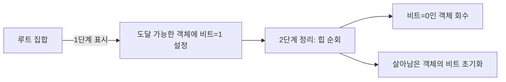

# GC와 런타임 메모리 관리: 자동으로 메모리를 거둬들이기

C나 C++에서는 프로그래머가 `malloc`과 `free`를 짝 맞춰야 합니다.

반면 Java·Python·JavaScript·Go 같은 언어는 "쓸모없어진 객체는 런타임이 알아서 회수한다"는 약속을 줍니다.

이 자동 회수를 **가비지 컬렉션(Garbage Collection, GC)** 이라 합니다. 처음 공부하며 깨달은 점은, GC가 여러 알고리즘을 가진 기법이며, 각자 "쓸모없다"를 판정하는 방식과 회수 타이밍이 다르다는 것입니다.

## 도달 불가능 객체의 판정 방법

GC의 핵심은 **도달 가능성(Reachability)** 입니다. 런타임은 루트 집합(root set)에서 출발합니다.

- 현재 실행 중인 모든 스레드의 스택 변수
- 모든 전역·정적 변수
- 레지스터에 담긴 값

루트에서 포인터 그래프를 타고 갈 수 있는 모든 객체는 살아 있습니다. 어디에서도 도달할 수 없는 객체는 죽었습니다 (=garbage).

지역 변수가 사라지거나 참조가 덮어쓰여서 그 객체로 가는 유일한 경로가 끊기는 순간, 그 객체는 쓸모없다고 판정됩니다.

```
 root
  │
  ├─▶ A ─▶ B ─▶ C
  │         │
  │         └─▶ D         ← 살아 있음 (루트로부터 도달 가능)
  │
  └─▶ E
                      F   ← 죽었음 (누구도 참조하지 않음)
```

도달 가능성은 "쓸모"의 근사치일 뿐입니다. 코드상 더 이상 쓰지 않을 객체라도 변수 스코프 안에 있으면 살아 있다고 판정됩니다. 그래도 실전에선 충분히 유용합니다.

## 대표 알고리즘

### Mark-and-Sweep

가장 기본적인 전략입니다.

1. **Mark**: 루트에서 시작해 그래프를 순회하며, 도달한 모든 객체에 "살아 있음" 비트를 셉니다.
2. **Sweep**: 힙 전체를 훑어 살아 있지 않은 객체(=비트가 0인)를 `free` 합니다.



Mark 동안에는 그래프 일관성을 유지해야 하므로 보통 세계를 멈춥니다 (Stop-The-World). 전체 힙을 훑기에 GC 한 번의 지연이 길어질 수 있습니다.

단순하지만 기반이 되는 알고리즘이라 거의 모든 현대 GC가 이 구조 위에 변형을 씁니다.

### Reference Counting

각 객체에 참조 횟수를 두고, 참조가 생길 때 +1, 해제될 때 −1 합니다. 0이 되는 순간 즉시 회수합니다.

```
   obj.refcount 가 0 → 바로 free
```

장점은 회수가 즉시 일어난다는 점입니다. Stop-the-world가 없습니다.

단점은 두 가지입니다.

- 참조가 생길 때마다 카운터를 갱신해야 해 모든 대입에 작은 비용이 듭니다.
- 순환 참조를 회수하지 못합니다. A→B, B→A가 서로를 참조하면 둘 다 refcount가 1 이상이라 영원히 살아 있습니다.

CPython이 대표적으로 reference counting을 기본으로 쓰지만, **순환 탐지기(cycle detector)** 를 주기적으로 돌려 이 한계를 보완합니다.

### Generational GC

흥미로운 경험적 관찰이 있습니다: **"대부분의 객체는 일찍 죽는다"** (weak generational hypothesis).

갓 만들어진 객체들은 대부분 금방 garbage가 됩니다. 오래 살아남은 객체는 계속 살아남는 경향이 있습니다.

이 관찰을 활용해 힙을 세대로 나눕니다.

```
 ┌─────────────────────┬────────────────────┬──────────────────┐
 │      Young Gen      │     Old Gen        │   Permanent Gen   │
 │   (새 객체)          │   (오래 살아남음)   │   (클래스 등)     │
 │   자주 짧게 GC       │   드물게 길게 GC    │   거의 GC 안 함   │
 └─────────────────────┴────────────────────┴──────────────────┘
```

- **Minor GC**: young gen만 회수. 빠릅니다.
- **Major GC**: old gen까지 포함해 회수. 느립니다.

대부분의 GC가 young gen에서 완료되어 전체 비용이 크게 줄어듭니다. Java의 HotSpot, .NET CLR, V8 같은 현대 런타임이 이 구조를 기본으로 합니다.

### Copying / Compacting GC

살아남은 객체를 다른 영역에 복사하면서 압축합니다. 힙이 연속된 하나의 덩어리로 재정리되므로 외부 단편화가 사라집니다. 할당은 포인터 증가만으로 끝납니다 (bump-pointer allocation).

대가로 복사 비용이 들고, 객체의 주소가 바뀝니다. 주소가 바뀌어도 루트와 내부 포인터를 전부 갱신해야 합니다. 런타임이 객체와 포인터의 정확한 위치를 알아야 가능합니다. 즉 타입 정보가 살아 있는 언어에서만 가능합니다.

## Conservative GC와 Precise GC

여기서 갈림이 생깁니다.

- **Precise GC**: 런타임이 "이 변수는 포인터다", "이 정수는 포인터가 아니다"를 정확히 압니다. 모든 포인터를 추적할 수 있으므로 copying/moving 가능합니다. Java·Go·JS 모두 이 경로입니다.
- **Conservative GC**: 타입 정보가 없습니다. 스택·레지스터에 있는 임의의 워드를 "혹시 이게 포인터일 수도 있다"고 **의심**해서 처리합니다.

## C에서 conservative GC가 필요한 이유

C는 타입을 런타임에 버립니다. 컴파일 후엔 "이 메모리 위치에 int가 있는지 포인터가 있는지"를 구분할 장치가 없습니다. 그래서 Boehm GC 같은 C용 GC는 conservative 방식을 씁니다.

```c
// 스택 한 워드를 봅니다.  값이 0x7f3a..0040 입니다.
// 이것이 포인터일까? 아니면 그냥 큰 정수일까?
//   -> 힙에 할당된 어떤 블록의 범위에 들어간다면 "포인터일 수도"
//   -> 그 블록을 살아 있다고 보수적으로 판정합니다.
```

부작용이 있습니다:

- **거짓 양성(false positive)**: 큰 정수 하나가 우연히 힙 주소와 같으면, 죽은 객체를 "살아 있다"고 판정합니다. 메모리가 절대로 100% 회수되지 않을 수 있습니다.

- **객체를 옮길 수 없습니다**: 어느 워드가 진짜 포인터인지 모르므로, 주소를 바꾸면 잘못 갱신할 위험이 있습니다. 따라서 copying/compacting GC는 불가능합니다.

- **순수 C 프로그램에 GC를 붙이려면** 라이브러리가 스택·힙·레지스터·전역을 모두 conservative하게 스캔해야 합니다. 이 오버헤드가 큽니다.

이것이 "C는 왜 GC를 자연스럽게 쓸 수 없는가"의 답입니다. 언어가 메타데이터를 버리는 선택을 한 순간, 자동 메모리 관리는 보수적이고 비효율적일 수밖에 없습니다.

## GC의 이점과 비용

**준다**:
- 메모리 수명 추적의 부담을 프로그래머에게서 런타임으로 옮깁니다.
- UAF·double free 같은 버그 범주 자체를 없앱니다 (refcount 사이클 같은 예외 제외).
- 복잡한 공유 객체 수명을 간단하게 표현할 수 있습니다.

**빼앗습니다**:
- **Stop-The-World 지연**: 한 번의 GC가 프로그램을 잠시 멈춥니다.
- **예측 불가능한 해제 타이밍**: 파일 디스크립터 같은 비메모리 자원은 GC에 맡기면 안 됩니다. `try-finally`, `with`, `defer` 같은 명시적 구문이 여전히 필요합니다.
- **메모리 사용량 상향**: 회수가 즉시 안 일어나므로 RSS가 평균적으로 큽니다.
- **튜닝의 복잡도**: Young/Old 크기, GC 알고리즘 선택, 힙 크기, Pause time 목표 등 수많은 파라미터가 성능을 바꿉니다.

## 정리

GC는 "더 이상 쓸 수 없는 객체"를 도달 가능성으로 근사해 회수하는 자동 메모리 관리 기법입니다.

Mark-and-sweep이 기초를 이루고, reference counting·generational·copying/compacting이 그 위에 각자의 철학으로 얹힙니다.

언어가 타입·참조 정보를 보존하면 precise GC가 가능합니다. C처럼 포기한 언어는 conservative GC의 한계를 감수해야 합니다.

**자동 메모리 관리의 수준은 그 언어가 런타임에 얼마나 많은 메타데이터를 유지하느냐에 정비례합니다.**
