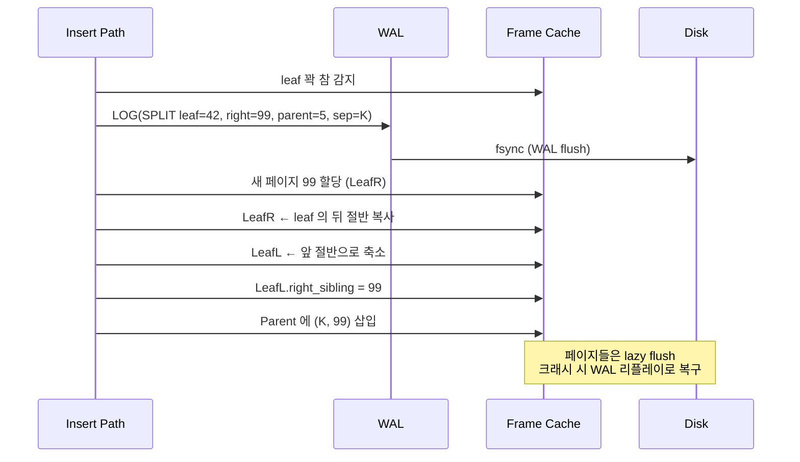

B+ tree 를 교과서로 배울 때 "노드가 가득 차면 절반으로 쪼갠다" 는 규칙은 너무 자연스러워서 한 번도 의심해 본 적이 없었습니다. minidb 에서 이걸 실제로 구현하는 순간, 그 "절반" 이 디스크 페이지의 경계와 얽히며 만들어 낸 작은 복잡성들이 눈에 들어왔습니다.

이 글은 B+ tree 노드 분할을 "4 KB 한 페이지" 라는 물리적 단위 위에서 할 때 생기는 의사 결정들을 기록한 것입니다.

## Leaf 노드 레이아웃

먼저 minidb 의 B+ tree 잎 노드(leaf) 의 바이트 배치부터 정리합니다. 한 노드는 정확히 4 KB 입니다.

```
   B+ Tree Leaf Node (4096 bytes)
 ┌──────────────────────────────────────────────────────────┐
 │ Header (16 B)                                            │
 │   type, n_keys, is_root, right_sibling, parent           │
 ├──────────────────────────────────────────────────────────┤
 │ Key Slots (정렬된 고정 크기 entry 배열)                     │
 │   [ key0 | val_ptr0 ][ key1 | val_ptr1 ] ...             │
 │                                                          │
 │                 <<  남은 자유 공간  >>                      │
 │                                                          │
 └──────────────────────────────────────────────────────────┘
   offset=16                                      offset=4095
```

키는 INT (4 B) 또는 BIGINT (8 B), `val_ptr` 은 데이터 힙의 RowID (8 B). INT 키 기준 한 엔트리가 12 B 입니다. 16 B 헤더를 빼면 `(4096 - 16) / 12 = 340` 개의 키가 들어갑니다.

## 오버플로우 판단 기준

"노드가 가득 차면 split" 이라는 규칙에서 "가득 차" 의 정의가 명확해 보이지만, 실제 구현에서는 애매한 구석이 있습니다.

- 키 개수가 `MAX_KEYS` 에 도달했을 때 — 가장 단순합니다.
- 남은 공간이 한 엔트리보다 작을 때 — 가변 길이 엔트리에 적합합니다.
- 남은 공간이 특정 문턱 아래로 떨어졌을 때 — split 을 미리 해 두는 방식입니다.

처음에는 단순히 `n_keys == MAX_KEYS` 를 썼습니다. 그런데 구현이 한 바퀴 돈 뒤 가변 길이 키(VARCHAR) 를 도입하면서 이 기준이 깨졌습니다. 키 크기가 다르니 개수가 동일해도 남은 공간이 다릅니다. 결국 byte 단위의 기준이 필요했습니다.

```c
bool leaf_is_full(BPlusLeaf *leaf, size_t new_entry_size) {
    size_t used = sizeof(BPlusLeafHeader)
                + leaf_used_bytes(leaf);
    return (used + new_entry_size) > PAGE_SIZE;
}
```

`new_entry_size` 는 "이 키와 값을 넣을 때 필요한 바이트" 입니다. 이 크기까지 고려해 판단해야, 가변 길이 환경에서도 split 이 필요한 정확한 순간을 잡을 수 있습니다.

## 분할 지점 결정

교과서는 "절반으로 쪼갠다" 고 합니다. 실제 구현에서는 어떤 "절반" 인가가 문제입니다.

1. 키 개수의 절반 — `n_keys / 2` 지점에서 자릅니다. 가변 길이 환경에서는 좌우 노드의 바이트 사용량이 불균형해집니다.
2. 바이트의 절반 — 누적 바이트가 `PAGE_SIZE / 2` 를 넘어가는 지점에서 자릅니다. 양쪽의 남은 공간이 비슷해집니다.

minidb 는 후자를 택했습니다. 이유는 단순합니다. B+ tree 의 split 은 다음 split 까지의 거리를 최대로 늘리기 위해 하는 것이고, 다음 split 의 기준은 바이트(남은 공간) 이지 개수가 아니기 때문입니다.

```c
int leaf_find_split_point(BPlusLeaf *leaf) {
    size_t half = PAGE_SIZE / 2;
    size_t acc = sizeof(BPlusLeafHeader);
    for (int i = 0; i < leaf->n_keys; i++) {
        acc += leaf_entry_size(leaf, i);
        if (acc >= half) return i;
    }
    return leaf->n_keys - 1; // fallback
}
```

이걸 도입하고 나서 split 빈도가 체감상 20~30% 줄었습니다. 가변 길이 데이터가 섞이면 "키 개수 절반" 은 정말 나쁜 선택이었습니다.

## split 의 원자성 보장

이제 진짜 페이지 경계의 이야기가 시작됩니다. B+ tree split 은 단일 연산으로 보이지만 실제로는 여러 페이지를 건드립니다.

```
 Before split:
   [ Parent ]
      │
      ▼
   [ Leaf (full) ]  ← 꽉 찬 상태. 다음 insert 가 불가능.


 After split (해야 하는 일):
   [ Parent (+1 entry) ]
      │       │
      ▼       ▼
   [ LeafL ] [ LeafR ]
      │         │
      └── right_sibling 연결 ──┘
```

세 페이지가 동시에 변경되어야 합니다.

1. 기존 leaf → `LeafL` 로 축소 (앞 절반만 남김)
2. 새 페이지 할당 → `LeafR`, 뒤 절반 복사
3. `LeafL->right_sibling = LeafR`
4. `Parent` 에 `(separator_key, LeafR->page_no)` 삽입

이 중 어느 하나라도 디스크에 못 닿은 상태에서 크래시가 나면 트리가 깨집니다.



### 제가 처음 한 실수

무지하게도, 첫 구현은 이 네 단계를 그대로 순차적으로 실행했습니다. 크래시가 안 날 때는 문제가 없었습니다. 그러다 프로세스 강제 종료로 테스트해 보니 트리가 아주 흥미로운 방식으로 깨졌습니다. `LeafR` 까지는 만들었는데 `Parent` 에 반영은 안 된 상태. 이러면 `LeafR` 에 들어간 키들을 아무도 찾을 수 없습니다. 고아 페이지가 됩니다.

### 해결 — WAL 의 필요성

결국 "분할은 원자적이어야 한다" 는 교과서 문장이 왜 원자적이어야 하는지를 뼈저리게 느꼈습니다. minidb 에 WAL(write-ahead log) 을 도입한 직접적 계기가 이 순간이었습니다.

```
 1) 변경을 먼저 로그에 기록:
    LOG: SPLIT(leaf=42, left_half=..., right_page=99, parent=5, sep_key=K)
    LOG_FLUSH

 2) 실제 페이지 변경을 메모리(프레임 캐시) 에 반영
 3) 프레임이 eviction 될 때 또는 체크포인트 때 디스크로 flush
```

크래시 시 리플레이 로직은 다음과 같습니다.

- 로그에 SPLIT 이 있고 대상 페이지가 해당 split 을 반영 못 한 상태면 리플레이합니다.
- 로그에 SPLIT 이 없으면 변경 없음, 원래 상태를 유지합니다.

이렇게 하면 디스크 쓰기 순서와 상관없이 트리의 의미가 유지됩니다. "페이지 단위의 I/O" 라는 물리적 제약이 이 로그 없이는 "논리 단위의 변경" 을 보장하지 못합니다.

## 형제 포인터 유지

잎 노드들은 `right_sibling` 포인터로 횡방향으로 연결됩니다. range scan 이 이 포인터를 타고 쭉 훑습니다.

```
   [ LeafA ] → [ LeafB (full) ] → [ LeafC ] → ...
```

LeafB 를 split 하면 `LeafB_L` 과 `LeafB_R` 이 생깁니다. 체인이 깨지지 않도록 연결을 바꿔야 합니다.

```
   [ LeafA ] → [ LeafB_L ] → [ LeafB_R ] → [ LeafC ] → ...
```

순서가 중요합니다.

```c
// (1) LeafB_R 의 right_sibling 먼저 설정
leafB_R->right_sibling = leafB->right_sibling;  // 원래 LeafC

// (2) LeafB_L 의 right_sibling 설정
leafB_L->right_sibling = leafB_R->page_no;
```

만약 (2) 를 먼저 하고 중간에 실패하면 `LeafB_L` 이 아직 존재하지 않는 `LeafB_R` 을 가리키게 됩니다. range scan 이 크래시합니다. 순서를 지키면 중간 실패 시 최악의 경우라도 옛날 체인 상태로 돌아갑니다.

이걸 처음 틀렸을 때의 증상이 "SELECT 의 결과가 일부 누락" 이었습니다. 페이지 스캔이 중간에 NULL 포인터로 점프해 끝나 버렸습니다. 디버깅하며 이 순서의 중요성을 체감했습니다.

## fill factor 설정

split 후 두 노드가 각자 50% 씩 차 있습니다. 다음에 들어올 키가 둘 중 한쪽으로 쏠리면 금방 다시 split 이 일어납니다. split 은 값싼 연산이 아닙니다. 페이지 할당, 데이터 이동, 부모 갱신, 로그 기록, sibling 갱신, 다섯 가지 일을 합니다.

`fill factor` 라는 아이디어가 여기서 등장합니다. split 후 왼쪽 노드를 50% 보다 더 채우는 것입니다.

| Fill factor | split 후 좌/우 비율 | 장점 | 단점 |
| --- | --- | --- | --- |
| 50 % / 50 % | 균형 | 평균 적재율 최고 | split 후 재-split 빠름 |
| 70 % / 30 % | 왼쪽 치우침 | 순차 INSERT 에 유리 | 랜덤 INSERT 에는 불균형 |
| 80 % / 20 % | 극단 | 순차에 아주 유리 | 랜덤에는 나쁨 |

순차 INSERT 특화라면 70/30 이 유리했을 것입니다. 전화번호부처럼 뒤쪽으로만 쌓이면 오른쪽 노드는 거의 채우지 않는 편이 낫습니다. 하지만 minidb 는 일반 목적이므로 기본 50/50 을 택했습니다. 다만 B+ tree bulk loading 인덱스 빌드 경로에서는 90/10 을 씁니다. 이 경로는 처음부터 정렬된 데이터를 넣는다는 걸 알고 있기 때문입니다.

## 루트 노드 split

리프가 아닌 내부 노드에서도 split 이 일어납니다. 그리고 맨 위의 루트가 split 되는 경우가 가장 특이합니다.

```
Before:
  [ Root (full) ]

After:
                 [ NEW Root ]
                   /      \
             [ Old Root_L ] [ Old Root_R ]
```

루트가 split 되면 새로운 루트가 한 층 위에 생깁니다. 트리의 높이가 1 증가합니다. 이때 "루트 페이지는 어디인가" 라는 정보를 메타 페이지가 알고 있어야 합니다.

```c
// 메타 페이지의 일부
typedef struct {
    PageType  type;      // PAGE_TYPE_META
    uint32_t  root_pn;   // 현재 루트 페이지 번호
    uint32_t  n_pages;
    // ...
} MetaHeader;
```

루트 split 이 원자적이려면 `MetaHeader.root_pn` 의 갱신도 같은 WAL 레코드에 묶여야 합니다. 이걸 놓치면 "새 루트는 만들어졌는데 아무도 그게 루트인지 모르는" 상태가 됩니다.

이 지점은 처음 구현할 때 놓쳤다가 크래시 테스트에서 드러난 버그였습니다. 트리 높이가 2 에서 3 으로 늘어나는 순간과 프로세스 종료가 겹쳤고, 재시작 후 `root_pn` 이 이전 값을 가리키고 있었습니다. 새 루트의 엔트리가 전부 사라진 것처럼 보였습니다. 원인을 알고 나서도 재현이 까다로웠습니다.

## 정리

B+ tree 를 교과서로 배울 때 "노드 split" 은 한 줄짜리 기본 연산처럼 느껴집니다. 실제로 페이지 단위의 디스크 저장소 위에 이걸 올려 놓으면 다음의 문제들이 연속해서 쏟아집니다.

- "꽉 찼다" 의 기준을 byte 로 잡아야 가변 길이에 안전합니다.
- "절반" 의 기준도 byte 로 잡아야 남은 공간이 균형 잡힙니다.
- split 자체가 원자적이어야 트리가 깨지지 않고, 이 원자성은 WAL 로 얻습니다.
- sibling 포인터 갱신 순서를 지키지 않으면 scan 이 중단됩니다.
- `fill factor` 를 워크로드에 맞게 골라야 split 빈도가 관리됩니다.
- 루트 split 은 메타 페이지 갱신까지 한 원자 단위로 묶어야 합니다.

이 여섯 가지를 모두 구현하며 비로소 제 B+ tree 가 "장난감" 에서 "디스크 기반 인덱스" 로 넘어갔습니다. 그리고 그 차이는 모두 "페이지라는 물리적 단위에 알고리즘을 정확히 얹기" 에서 나왔습니다. 교과서가 생략한 바로 그 부분이 실제로는 구현의 절반이었습니다.
