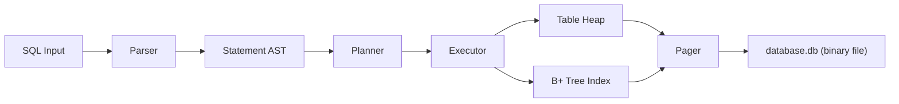

## 1. 이 과제의 본질

이번 과제의 본질은 단순한 메모리 자료구조 구현이 아닙니다. 핵심은 `SQL 입력 → 실행 계획 → 디스크 저장 구조 → 인덱스 활용` 흐름이 이어지는 작은 DB 엔진을 만드는 것입니다.

구현은 아래 전제를 가집니다.

- 저장 엔진(pager, heap, B+ tree) 은 처음부터 새로 만듭니다.
- parser 는 기존 구조를 참고하되, 이번 과제에 필요한 최소 문법으로 간소화합니다. parser 는 이번 과제의 핵심이 아니라 저장 엔진이 핵심이므로, parser 에 시간을 과도하게 쓰지 않습니다.
- parser · planner · executor · pager · heap · B+ tree 경계를 명확히 드러내는 것을 우선합니다.
- 목표는 "분업으로 빠르게 완성" 이 아니라 "전 과정을 이해하며 구현" 입니다.

따라서 이번 구현의 중심은 두 가지입니다.

1. 바이너리 파일에 테이블과 인덱스를 저장하고 다시 불러올 수 있어야 합니다.
2. `WHERE id = ?` 일 때 B+ 트리를 통해 디스크 페이지 수를 줄여야 합니다.

결과물은 "메모리에서만 동작하는 B+ 트리 데모" 가 아니라 "디스크에 저장되는 SQL 엔진의 최소 구현" 이어야 합니다.

## 2. 최종 목표

반드시 보여줘야 할 것은 다음과 같습니다.

- `.db` 바이너리 파일 생성
- 프로그램 재시작 후 기존 데이터 load
- INSERT 시 자동 증가 id 부여
- row 를 디스크 page 에 저장
- `id -> row 위치` 를 B+ 트리에 저장
- `SELECT ... WHERE id = ?` 는 인덱스 사용
- `SELECT ... WHERE name = ?` 같은 다른 필드는 테이블 스캔
- DELETE 후 tombstone, free slot, free page 재사용
- EXPLAIN, `.btree`, `.pages` 로 내부 구조 설명
- 1,000,000 건 이상 insert 후 성능 비교

## 3. 범위 정의

### 구현 범위

- 단일 `.db` 파일 기반 저장소
- 고정 크기 page 기반 pager
- 고정 길이 row 와 slotted heap page
- 단일 테이블 중심 구현
- INSERT, SELECT, DELETE, EXPLAIN
- `WHERE id = value`, `WHERE non_id_field = value`
- id 단일 인덱스용 B+ 트리
- B+ 트리 search / insert / split / delete / merge
- 파일 열기, 파일 생성, 파일 메타데이터 load
- dirty page flush
- free slot · free page 재사용
- DB 전역 RW lock
- `.btree`, `.pages`, `.stats`

### 제외 범위

- 트랜잭션
- crash recovery
- WAL
- UPDATE
- 다중 인덱스
- multi-table 일반화
- 가변 길이 row
- cost-based SQL optimizer 일반화
- page-level latch coupling
- VACUUM 실제 구현

핵심은 다음과 같습니다.

> 디스크 저장 + SQL 경계 유지 + id 인덱스 적용 + 삭제와 재사용 경로 설명 가능.

## 4. 최소 스펙이지만 SQL 답게 설계하는 기준

최소 스펙으로 가더라도 아래 구조는 유지해야 합니다.

이 구조를 유지해야 하는 이유는 각 계층의 책임이 다르기 때문입니다.

- parser 는 문장을 해석합니다.
- planner 는 인덱스를 탈지 결정합니다.
- executor 는 table, index, pager 를 호출합니다.
- pager 는 메모리가 아니라 디스크 page 를 다룹니다.

이렇게 해야 지금은 id 인덱스 하나만 구현하더라도, 나중에 `WHERE age = ?` 나 range scan 을 추가할 수 있습니다.

## 5. 핵심 설계 결정

### 5.1 고정 길이 row 로 시작합니다

가변 길이 row 는 공간 관리 난이도를 크게 높입니다. 이번 과제에서는 row 크기를 스키마에서 미리 계산해 고정합니다. VARCHAR 는 선언된 최대 길이까지 공간을 확보합니다. 이 결정은 슬롯 힙 페이지의 offset 계산을 단순하게 만들고, B+ tree 리프의 엔트리 크기도 고정시킵니다.

### 5.2 B+ 트리의 노드는 파일의 page

노드를 포인터 구조체로 두면 프로그램이 종료될 때 전부 사라집니다. 파일에 복원하려면 직렬화 계층이 필요합니다. minidb 는 이 계층을 없애기 위해 "노드 = page" 구조를 택합니다. 자식 참조는 포인터가 아니라 `page_id` (파일 오프셋의 배수) 입니다.

### 5.3 delete 는 tombstone 과 free list 재사용으로

실제 파일을 compaction 하려면 모든 행의 위치가 바뀌고 인덱스가 전부 갱신되어야 합니다. 이번 과제는 그 비용을 피하기 위해 tombstone 방식을 씁니다. 슬롯을 FREE 로 표시하고 free list 에 넣어 두면, 다음 INSERT 가 그 자리를 재사용합니다.

### 5.4 id 자동 증가는 헤더 페이지에 저장

`next_id` 값을 DB 헤더 페이지에 박아 두면, 프로그램을 재시작해도 같은 ID 흐름을 이어갈 수 있습니다. INSERT 마다 이 값을 증가시키고 dirty 표시만 해 두면 됩니다.

## 6. 계층 경계를 지키는 이유

parser 가 storage 를 직접 호출하지 않는 이유, planner 가 pager 를 모르고 pager 가 planner 를 모르는 이유를 한 문장으로 요약하면 다음과 같습니다.

> 한 계층의 결정이 다른 계층의 내부를 알 필요가 없도록 유지하려는 것입니다.

이 분리가 지금 당장은 과해 보입니다. 기능이 단순하기 때문입니다. 하지만 기능이 늘어날 때 (예: range scan, 다중 인덱스, UPDATE) 이 경계가 있어야 새 기능이 기존 코드 전반을 깨뜨리지 않습니다.

## 7. 정리

이 계획서는 "SQL 엔진을 완성한다" 는 문서가 아니라 "SQL 엔진을 어디까지 끊어서 만들 것인가" 를 정리한 문서입니다. 기능의 폭은 의도적으로 좁게 잡고, 계층 분리의 깊이는 넓게 잡습니다. 이렇게 하면 짧은 기간에 구현하더라도 실제 DB 엔진이 가진 구조적 특징 — 파일 기반 저장, 인덱스 분기, tombstone 재사용, 페이지 단위 I/O — 을 모두 한 번씩 경험할 수 있습니다.
