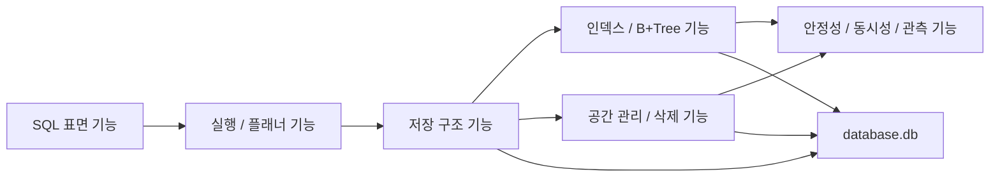

## 1. 이 문서의 목적

이 문서는 이번 프로젝트의 구현 계획을 바꾸기 위한 문서가 아닙니다. 이미 정리된 구현 계획을 유지한 채, "무엇을 이번 주에 넣고 무엇을 다음 단계로 미룰지" 선택하기 위한 범위 결정 가이드입니다.

다음 질문에 답하기 위해 만듭니다.

- 지금 우리 팀이 구현할 수 있는 SQL 과 DBMS 기능은 무엇이 있는가?
- 각 기능은 어떤 저장 구조나 실행 구조에 의존하는가?
- 그 기능을 구현하면 무엇을 배우게 되는가?
- 실제 DBMS 에서는 그 기능이 어떻게 쓰이는가?
- 이번 주 일정에서 무엇을 우선 구현하는 것이 가장 설득력 있는가?

## 2. 읽는 방법

이 문서는 아래 순서로 읽기를 권장합니다.

1. 먼저 전체 기능 지도를 보고 어떤 축의 기능들이 있는지 큰 그림을 이해합니다.
2. 다음으로 기능 카탈로그를 보며 각 기능의 의존성, 난이도, 학습 가치를 비교합니다.
3. 마지막으로 추천 패키지 3 개 중 하나를 선택해 이번 주 개발 범위를 결정합니다.

기본 추천 범위는 `Package 2. 저장엔진 심화형` 입니다. 이 패키지가 현재 팀의 우선순위인 "메모리 친화성, 삭제 경로, 방어 코드, B+ 트리 이해" 에 가장 잘 맞습니다.

## 3. 한 눈에 보는 기능 지도

### 3.1 SQL 표면 기능

사용자가 직접 입력하는 명령과 그 명령이 어떤 기능을 노출하는지에 관한 영역입니다. 이 축을 구현하면 "SQL 이 단순한 문자열이 아니라 엔진 기능을 호출하는 인터페이스" 라는 점을 이해하게 됩니다.

### 3.2 실행과 플래너 기능

parser, statement, planner, executor 같은 논리적 처리 단계를 다룹니다. 이 축을 구현하면 문법 해석과 저장소 접근 전략 결정을 분리하는 이유를 배우게 됩니다.

### 3.3 저장 구조 기능

`.db` 파일, page, pager, row layout, heap page 를 다룹니다. CSAPP 9 장의 page 관점이 실제 데이터 저장 엔진으로 어떻게 이어지는지 이해하게 됩니다.

### 3.4 인덱스와 B+Tree 기능

`WHERE id = ?` 를 빠르게 만들기 위한 탐색·삽입·삭제·분할·병합 기능을 다룹니다. 왜 실제 DBMS 가 해시 대신 B+ 트리를 많이 쓰는지, 그리고 page 단위 fan-out 이 왜 중요한지를 배우게 됩니다.

### 3.5 공간 관리와 삭제 기능

tombstone, free slot, free page, allocator, vacuum 을 다룹니다. "삭제는 단순히 row 를 지우는 행위가 아니라 공간 재사용 정책을 설계하는 문제" 임을 이해하게 됩니다.

### 3.6 안정성·동시성·관측 기능

file magic, page 검증, corruption detection, lock, debug 명령을 다룹니다. "동작하는 프로그램" 과 "망가졌을 때도 설명 가능한 엔진" 의 차이를 배우게 됩니다.

## 4. 대표 기능 카탈로그

각 기능은 동일한 기준으로 정리합니다. 아래는 대표 항목만 발췌합니다.

### A.1 REPL 과 SQL 파일 실행

- 대화형 입력과 `.sql` 파일 일괄 실행을 지원하는 입구입니다.
- 테스트, 벤치마크, 데모를 모두 같은 인터페이스로 돌릴 수 있습니다.
- 세미콜론 분리, 멀티라인 입력, 에러 후 세션 상태 관리가 리스크 포인트입니다.
- 실제 DBMS 의 `psql`, `sqlite3`, MySQL CLI 가 같은 역할을 합니다.

### A.2 CREATE TABLE

- 스키마를 DB 헤더 페이지에 저장하는 경로입니다.
- 컬럼 이름과 타입을 고정 크기 배열에 담기 위해 `column_count` 와 `row_size` 를 여기서 계산합니다.
- 이 기능이 있어야 INSERT 와 SELECT 가 의미를 가집니다.

### B.1 Planner — 인덱스 vs 스캔 결정

- `WHERE` 절의 컬럼이 인덱스 대상이면 INDEX_LOOKUP 을 선택합니다.
- 그 외는 TABLE_SCAN 입니다.
- 이 결정이 성능의 거의 전부를 좌우합니다.
- cost-based optimizer 없이 rule-based 로 충분합니다.

### C.1 Pager 와 프레임 캐시

- 디스크 페이지를 메모리 프레임에 올리고 LRU·pin·dirty 로 관리합니다.
- 저장 엔진의 심장입니다. 이 계층이 없으면 상위 계층이 전부 `pread` / `pwrite` 를 직접 호출해야 합니다.
- 구현 난이도가 높아 보이지만 Step 2 에서 반드시 끝내야 다음이 가능합니다.

### D.1 B+ Tree Leaf 단일 노드

- 아직 split 이 없는 상태에서 insert·search 를 먼저 돌립니다.
- 단일 노드가 꽉 차기 전까지는 "정렬된 배열 + 이진 탐색" 으로 충분합니다.
- 이 단계까지가 Step 4 입니다.

### D.2 B+ Tree Split 과 내부 노드

- 꽉 찬 리프를 둘로 나누고 승격된 키를 내부 노드에 삽입합니다.
- 새 루트 생성 경로, fill factor, sibling 포인터 갱신 순서가 함께 묶입니다.
- 이번 과제에서 가장 난이도가 높은 구간입니다.

### E.1 Tombstone 과 free slot 재사용

- DELETE 는 행을 즉시 지우지 않고 슬롯만 FREE 로 표시합니다.
- 다음 INSERT 가 이 슬롯을 재사용합니다.
- 디스크 compaction 의 복잡도를 피하면서도 공간을 재활용합니다.

### E.2 free page list

- 한 페이지가 완전히 비면 free page list 에 반환합니다.
- 새 페이지 할당 요청이 오면 여기서 먼저 꺼냅니다.
- LIFO 로 관리하면 구현이 가장 단순합니다.

### F.1 EXPLAIN, `.btree`, `.pages`

- 내부 구조를 사람이 읽을 수 있는 형태로 출력하는 명령입니다.
- 디버깅과 발표 양쪽에서 가장 유용합니다.
- 파서에 작은 메타 명령을 추가하고, executor 에서 해당 구조를 덤프하는 경로를 붙이면 됩니다.

## 5. 추천 패키지

### Package 1. 데모 완성형

표면 기능을 넓게 갖추되 저장 엔진은 얕습니다. REPL, CREATE/INSERT/SELECT, 단일 노드 B+ tree, 간단한 EXPLAIN.

### Package 2. 저장 엔진 심화형 (기본 추천)

파서는 최소한으로 줄이고, 저장 엔진 · B+ tree 분할 · free list · tombstone 에 집중합니다. 이번 과제의 권장 범위입니다.

### Package 3. 관측 특화형

페이지 검증, corruption detection, `.stats` 까지 포함합니다. Package 2 가 끝난 팀이 덤으로 도전할 수 있는 범위입니다.

## 6. 선택 기준

다음 세 질문을 순서대로 묻습니다.

1. 이 기능이 저장 엔진의 핵심 경로(INSERT·SELECT·DELETE) 에 들어갑니까?
2. 이 기능을 생략하면 "이 엔진은 디스크 기반이다" 라는 주장이 깨집니까?
3. 이 기능이 발표에서 한 장면으로 보여줄 가치가 있습니까?

세 질문 모두에 "예" 라면 이번 주에 넣습니다. 하나라도 "아니오" 이면 다음 단계로 미룹니다. 이 기준이 있어야 범위를 끝없이 늘리지 않고 한 주에 수렴시킬 수 있습니다.
