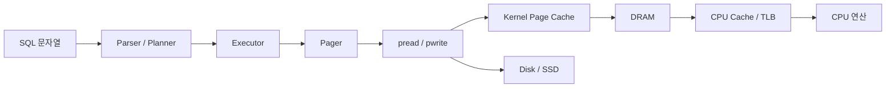

## 1. 이 가이드의 목적

가상 메모리, OS 파일 입출력, 메모리, CPU 연산, 버스 관점을 따로따로 외우는 것이 목적이 아닙니다. 핵심은 이 개념들이 이번 과제의 설계 선택으로 어떻게 이어지는지 아는 것입니다.

이 문서는 다음 질문에 답하기 위해 만듭니다.

- 왜 DB 를 page 단위로 저장하는가?
- 왜 `WHERE id = ?` 에서 B+ 트리가 빠른가?
- 왜 선형 탐색은 느린가?
- 왜 row 를 고정 길이로 잡는가?
- 왜 `pread` / `pwrite` 기반 pager 가 자연스러운가?

## 2. 한 눈에 보는 전체 흐름

이 그림의 핵심은 다음과 같습니다.

- SQL 은 결국 page read/write 요청으로 바뀝니다.
- page 요청은 커널을 통해 파일 I/O 로 처리됩니다.
- 실제 속도는 디스크만이 아니라 page cache, TLB, CPU cache, bus 이동 비용의 영향을 받습니다.

## 3. 관점별 핵심 해석

### 3.1 가상 메모리 관점

OS 는 메모리를 page 단위로 관리합니다. 파일도 page cache 를 통해 page 단위로 다뤄집니다. 주소 변환은 TLB 와 page table 에 의존합니다.

이번 과제에서의 의미는 다음과 같습니다.

- DB 도 4096 B page 단위로 저장하는 것이 자연스럽습니다.
- heap row 와 B+ 트리 node 를 page 단위로 관리하면 OS 의 메모리 모델과 잘 맞습니다.
- page 를 기본 단위로 잡으면 디스크 I/O 와 메모리 관리가 같은 언어로 설명됩니다.

설계 판단으로 이어지는 규칙은 다음과 같습니다.

- 파일 포맷은 `page_id -> offset` 구조로 설계합니다.
- heap page 와 index page 를 동일한 `PAGE_SIZE` 로 맞춥니다.
- B+ 트리 fan-out 을 크게 잡아 tree height 를 줄입니다.

### 3.2 OS 파일 입출력 관점

파일 I/O 는 시스템 콜 경계가 있습니다. 작은 읽기나 쓰기를 자주 하면 syscall overhead 가 커집니다. 파일은 커널 page cache 를 거쳐 읽히고 쓰이는 경우가 많습니다.

이번 과제에서의 의미는 다음과 같습니다.

- row 하나마다 파일에 바로 쓰면 느립니다.
- page 하나를 메모리에 올리고, 수정한 뒤, page 단위로 flush 하는 구조가 좋습니다.
- DB file header, heap page, B+ tree page 를 모두 같은 pager 로 읽고 쓰는 것이 맞습니다.

추천 구현 선택은 다음과 같습니다.

- `open` + `pread` + `pwrite` 기반 구현 (mmap 이 아닙니다)
- 프레임 캐시로 "메모리에 올라온 page" 와 "디스크에 있는 page" 를 구분
- 쓰기는 모아서 flush (매 수정마다 쓰지 않음)

### 3.3 메모리 관점

`malloc` 은 비용이 있습니다. row 별로 `malloc` 을 하면 힙 단편화가 생기고 locality 가 떨어집니다. 그 대신 페이지 한 장을 한 번에 받아서 그 안에 row 들을 밀어넣는 편이 cache miss 가 적습니다.

이번 과제에서의 의미는 다음과 같습니다.

- row 는 `malloc` 대상이 아니라 페이지 내부의 offset 입니다.
- 연산 중에는 페이지 버퍼 위에서 직접 읽고 쓰고, 필요할 때만 값을 해석합니다.

### 3.4 CPU 연산 관점

B+ tree 내부 노드에서 이진 탐색을 하면 대부분 캐시 히트입니다. 한 페이지가 4 KB 이고 CPU L1 캐시가 그보다 크므로, 한 페이지 안에서의 탐색은 빠릅니다. 정렬된 배열 + 이진 탐색이 링크드 리스트 탐색보다 항상 이길 수 있는 이유입니다.

### 3.5 버스 관점

메모리에서 CPU 까지, 디스크에서 메모리까지의 데이터 이동에는 각각 대역폭 상한이 있습니다. 한 번의 I/O 로 4 KB 를 가져올 때 이 대역폭을 최대한 활용하려면, 그 4 KB 안에 다음 결정에 필요한 정보가 밀집해 있어야 합니다. B+ tree 가 한 노드에 키를 많이 욱여넣는 이유입니다.

## 4. 설계 결정을 관점으로 설명하기

### 4.1 왜 page 단위로 저장하는가

가상 메모리 관점: OS 가 이미 page 단위로 일하므로 맞추는 것이 자연스럽습니다.
파일 I/O 관점: 커널 page cache 의 단위와 정확히 맞아 read-modify-write 를 피합니다.
메모리 관점: 한 페이지를 한 번에 잡으면 locality 가 좋아집니다.
CPU 관점: 4 KB 정도면 대부분 L1/L2 안에 들어옵니다.

### 4.2 왜 B+ 트리가 빠른가

CPU 관점: 한 노드 안에서의 이진 탐색은 캐시 히트 위주라 빠릅니다.
버스 관점: 한 번의 I/O 로 가져온 4 KB 가 "다음 어디로 가야 하는지" 를 모두 담고 있습니다.
파일 I/O 관점: fan-out 이 높을수록 트리 높이가 낮아져 I/O 횟수가 줄어듭니다.

### 4.3 왜 선형 탐색은 느린가

파일 I/O 관점: 힙 페이지 전체를 읽어야 합니다.
CPU 관점: deserialize 와 문자열 비교가 매 row 마다 발생합니다.
버스 관점: 전송량이 B+ tree 탐색의 수천 배입니다.

### 4.4 왜 row 를 고정 길이로 잡는가

메모리 관점: 페이지 내 offset 계산이 상수 시간입니다.
파일 I/O 관점: 한 row 의 디스크 위치를 `(슬롯 번호 × row_size)` 로 즉시 계산할 수 있습니다.
CPU 관점: 역직렬화 루프가 분기 없이 진행됩니다.

## 5. 발표에서 말할 수 있는 한 줄 요약

- OS 가 page 단위로 메모리와 파일을 다루기 때문에, DB 도 page 단위로 row 와 index 를 저장하도록 설계했습니다.
- B+ tree 는 한 페이지 안에 많은 키를 넣어 디스크 I/O 한 번에 많은 결정을 내릴 수 있게 합니다.
- 저장 엔진의 설계는 "CPU 관점", "메모리 관점", "파일 I/O 관점", "버스 관점" 에서 각각 타당해야 합니다.

## 6. 정리

같은 설계가 여러 관점에서 동시에 타당하다는 사실이, 그 설계가 자의적이지 않음을 보여줍니다. 4 KB 페이지, 높은 fan-out 의 B+ tree, 고정 길이 row, `pread` / `pwrite` 기반 pager. 이 네 가지 선택은 다섯 관점 모두에서 같은 결론을 가리킵니다. 바로 그 합치가 이 설계를 "관습" 이 아니라 "근거 있는 결정" 으로 만듭니다.
