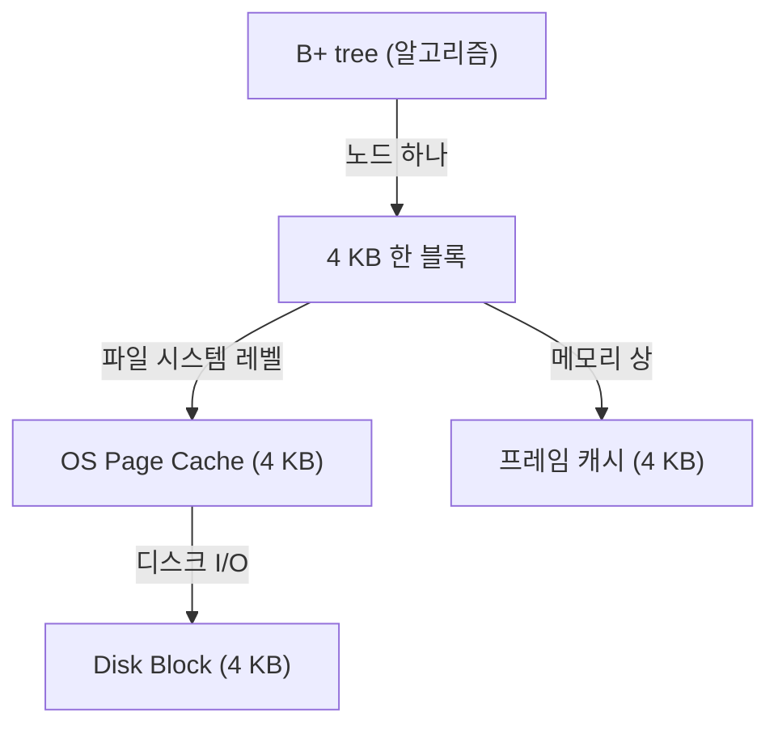

minidb 를 C 로 구현하면서 가장 먼저 마주친 결정이 하나 있었습니다. "한 번에 디스크에서 읽고 쓸 단위를 얼마로 잡을 것인가" 였습니다.

교과서는 당연한 듯 "페이지 단위" 라고 말합니다. 4 KB, 8 KB, 혹은 16 KB. 하지만 직접 구현하는 순간, 같은 단어 "페이지" 가 여러 계층에서 다른 의미로 쓰인다는 사실을 깨달았습니다. 디스크의 단위인지, OS 페이지 캐시의 단위인지, B+ tree 노드의 단위인지. 결정은 단순해 보였지만 세 단위가 어떻게 맞물리는가가 전체 성능을 결정하는 문제였습니다.

## 페이지, 그런데 정의가 세 가지

처음 구현을 시작했을 때 저는 이렇게 생각했습니다.

- 디스크: 512 B 블록(섹터) 이 물리 단위입니다.
- OS page cache: 4 KB 페이지가 캐싱의 단위입니다.
- B+ tree 노드: 성능 실험으로 여러 크기를 시도하고 선택할 수 있습니다.

B+ tree 를 구현하는 입장에선 노드 크기를 독립적으로 정하고 싶었습니다. 512 B, 2 KB, 8 KB, 각각 벤치마크 해보고 최적값을 찾으면 된다고 짐작했습니다.

그런데 실제로 `pread` / `pwrite` 시스템 콜로 파일을 읽고 쓸 때 커널이 어떻게 동작하는지 추적해보니 이야기가 달라졌습니다.

## 4 KB 의 비밀

`pread(fd, buf, 2048, offset)` 으로 2 KB 만 읽는다고 해봅니다. 커널 입장에서는 이 요청이 실제로 다음과 같이 처리됩니다.

1. `offset` 을 포함하는 4 KB 페이지 전체가 페이지 캐시에 올라와 있는지 확인합니다.
2. 없으면 디스크에서 한 페이지(4 KB) 를 읽어 캐시에 넣습니다.
3. 캐시에서 요청한 2 KB 만 유저 버퍼로 복사합니다.

즉 2 KB 를 읽겠다고 말해도 디스크는 4 KB 를 읽습니다.

`pwrite(fd, buf, 2048, offset)` 도 비슷합니다. 디스크 쓰기는 4 KB 단위로 일어나기 때문에, 기록 대상 페이지가 캐시에 없으면 먼저 그 페이지를 읽어 온 뒤 2 KB 만 고쳐 쓴 뒤 페이지 전체를 디스크에 반영합니다. 이것이 그 유명한 read-modify-write 오버헤드입니다.

이 관찰이 설계를 바꿨습니다. B+ tree 노드를 4 KB 보다 작게 만들면, 노드 하나의 I/O 비용이 4 KB 짜리와 완전히 같습니다. 4 KB 를 꽉 채워 쓰지 않는 모든 공간은 그냥 낭비였습니다.

반대로 4 KB 보다 크게 만들면 어떻게 될까요. 예를 들어 8 KB 짜리 노드를 생각해봅니다. 그럼 한 노드가 항상 두 페이지를 차지합니다. 한 페이지가 캐시에서 쫓겨나면 노드가 반쪽짜리가 됩니다. 읽을 때도 쓸 때도 I/O 가 두 번입니다. 8 KB 노드는 4 KB 노드 2 개보다 느렸지 빠르지 않았습니다.

## 설계 결정

결론은 다음과 같습니다.

```
 DB 파일의 한 블록    = 4 KB
 OS 페이지 한 개     = 4 KB
 B+ tree 한 노드    = 4 KB
 프레임 캐시 한 프레임 = 4 KB
```

세 계층이 같은 단위를 쓰기로 결정했습니다. 각 계층이 따로따로 4 KB 를 주장하지만, 그걸 받아들이고 한 값으로 통일하니 서로를 증폭시켰습니다.

이렇게 정렬했을 때 다이어그램은 다음과 같습니다.



## 4 KB 정렬로 얻은 효과

- I/O 정확성: minidb 가 "노드 하나 로드" 라고 말하면 디스크에서도 정확히 한 번의 페이지 I/O 만 일어납니다. 추가 페이지가 끼어들거나 read-modify-write 가 발생하지 않습니다.
- 캐시 일관성: minidb 의 프레임 캐시와 OS 페이지 캐시의 단위가 같으니 둘 중 하나에서 교체가 일어나도 단위가 엇갈리지 않습니다.
- 단순한 오프셋 계산: 노드 번호 n 의 파일 오프셋이 `n * 4096` 입니다. 경계 문제 없이 명확합니다.

## 알고리즘 설계와 하드웨어 단위의 합치

학부 자료구조 수업에서 B+ tree 를 배울 때, 노드 크기는 그냥 설계 파라미터였습니다. "fan-out 이 크면 트리 높이가 낮아진다" 정도로만 이해했습니다.

직접 디스크 기반 엔진을 짜 보면서 B+ tree 가 왜 디스크 기반 DB 의 표준 자료구조인지를 새롭게 이해하게 됐습니다.

B+ tree 는 노드 하나 안에 많은 키를 욱여넣기 때문에 한 번의 I/O 로 많은 정보를 얻습니다. 그런데 "한 번의 I/O" 는 실제로는 "한 페이지의 로드" 입니다.

그렇다면 "한 노드 = 한 페이지" 로 맞춰질 때 알고리즘이 처음 의도한 "I/O 를 최소화한다" 는 목적이 온전히 달성됩니다. 이는 우연이 아니라 B+ tree 의 설계 자체가 페이지 단위 저장소를 전제로 했다는 의미입니다.

같은 원리가 위로도 아래로도 이어집니다. 위로는 OS 의 메모리 관리가 4 KB 페이지 단위로 이루어지고, 아래로는 스토리지 컨트롤러가 4 KB 섹터를 기본으로 씁니다. 하드웨어와 OS 와 소프트웨어 알고리즘, 세 계층이 모두 같은 단위에서 자신의 최선 성능을 발휘하도록 진화했습니다.

4 KB 하나에서 만나는 것이 그 진화의 결과였습니다.

CSAPP 9 장에서 가상 메모리를 배우면서 "왜 4 KB 인가" 에 물리적 근거를 찾았습니다. 너무 작으면 페이지 테이블 엔트리가 폭발하고, 너무 크면 내부 단편화가 커지는 타협점. 그 타협점이 디스크 섹터, DB 노드, 메모리 페이지 모두에게 동일한 결론이었다는 사실이 가장 오래 기억에 남았습니다.

## 벤치마크로 확인

1 백만 행을 INSERT 하고 SELECT 하는 테스트를 노드 크기만 바꿔가며 돌려봤습니다.

| 노드 크기 | INSERT 1M (ms) | SELECT 평균 (μs) |
| --- | --- | --- |
| 512 B | 18,420 | 42 |
| 1 KB | 12,880 | 31 |
| 2 KB | 9,460 | 24 |
| 4 KB | 7,210 | 19 |
| 8 KB | 9,880 | 28 |
| 16 KB | 13,540 | 41 |

4 KB 를 중심으로 대칭적인 곡선이 나왔습니다. 작은 노드는 I/O 횟수가 늘어났고(트리 높이 증가와 페이지 낭비), 큰 노드는 한 노드당 I/O 비용이 오르며 캐시 효율이 떨어졌습니다. 이론이 그대로 숫자로 나타났을 때 구현 결정을 확신하게 됐습니다.

## 정리

"DB 한 블록 = OS 한 페이지 = B+ tree 한 노드" 는 minidb 전체의 가장 근본적인 결정이었습니다. 세 단위를 맞추는 것만으로 I/O 횟수, 캐시 효율, 오프셋 계산이 모두 정돈됐습니다.

그리고 이 정렬이 특정 엔진에만 해당되는 팁이 아니라, B+ tree 라는 알고리즘이 페이지 기반 저장소를 전제로 설계되었기에 발생하는 자연스러운 합치라는 사실을 직접 구현하며 비로소 체감했습니다. 알고리즘이 왜 그런 모양으로 생겼는지를 이해하려면, 그 알고리즘이 돌아갈 하드웨어의 단위를 먼저 알아야 합니다.
