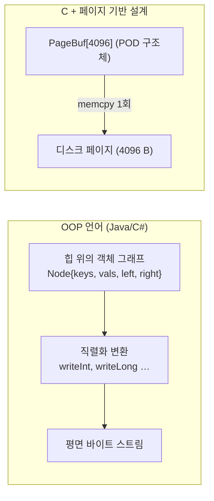

minidb 를 짜며 "이게 되네?" 하고 속으로 짧게 웃은 장면이 하나 있습니다. B+ tree 노드 하나를 디스크에 저장하는 코드가 딱 두 줄이었을 때입니다.

```c
memcpy(frame->data, node, sizeof(*node));
pwrite(fd, frame->data, PAGE_SIZE, pn * PAGE_SIZE);
```

직렬화 라이브러리도, JSON 도, 프로토콜 버퍼도, 필드 하나하나 byte-by-byte 로 쓰는 코드도 없었습니다. `memcpy` 한 번이 직렬화였고, `pwrite` 한 번이 I/O 였습니다.

이게 가능하게 만든 조건이 몇 가지 있었습니다.

## 전제 1 — POD 구조체로만 구성합니다

구조체 안에 포인터가 들어 있으면 이 트릭은 불가능합니다. 포인터의 값은 런타임 메모리의 주소이고, 디스크에 써 봤자 다음 실행에서 의미가 없습니다.

그래서 노드 구조체 안의 모든 "참조" 는 포인터가 아니라 `page_no` 같은 ID 로 표현했습니다.

```c
typedef struct {
    PageType type;            // 4B
    uint16_t n_keys;          // 2B
    uint16_t is_root;         // 2B
    uint32_t right_sibling;   // 4B  ← 포인터 아님. 페이지 번호.
    uint32_t parent;          // 4B
    // 이후는 payload: 키들과 값들이 바이트 배열로 누워 있음
    uint8_t  payload[PAGE_SIZE - 16];
} BPlusLeafHeader;
```

구조체 전체가 Plain Old Data 입니다. C++ 의 `is_trivially_copyable` 에 해당하는 성질입니다. 이 성질이 만족되는 한, `memcpy` 와 디스크는 같은 것을 봅니다.

## 전제 2 — 패딩을 없앱니다

`__attribute__((packed))` 로 컴파일러의 자동 정렬을 끕니다. 패딩이 섞여 있으면 디스크에 쓴 레이아웃과 다른 시스템에서 읽은 레이아웃이 어긋날 수 있습니다.

packed 는 성능을 약간 포기하는 대신 바이트 레벨에서 예측 가능한 모양을 보장합니다. 대부분의 필드는 4 바이트와 2 바이트 정렬이 맞게 직접 배치했으므로 실제로 잃는 성능은 거의 없었습니다. 이 균형은 필드 순서를 수동으로 맞추는 대가로 얻었습니다.

## 전제 3 — 엔디안이 같습니다

같은 기계에서만 파일을 돌리면 엔디안 문제가 없습니다. 리눅스 x86-64 기준으로 전부 little-endian 입니다. 다른 아키텍처로 파일을 옮기면 바이트 순서가 바뀌어 값이 깨지겠지만, 그건 원래 DB 엔진들도 포맷을 선언해서 해결하는 영역입니다. minidb 는 현재 이 호환성을 포기하고 로컬 파일 포맷으로만 동작합니다.

## 슬롯 페이지에서의 memcpy

더 흥미로운 것은 슬롯 기반 힙 페이지였습니다. 한 페이지에 가변 길이의 튜플 여러 개를 저장하는 구조입니다.

```
   HeapPage 레이아웃 (4 KB)
 ┌──────────────────────────────────────────────┐
 │ Header (type, slot_count, free_start, ...)   │
 ├──────────────────────────────────────────────┤
 │ Slot0 offset | Slot1 offset | Slot2 offset ...│  ← 슬롯 디렉터리
 │                                                │    (free_start 까지 자람)
 │                                                │
 │          << 중간은 비어 있는 자유 공간 >>        │
 │                                                │
 │              TupleN | TupleN-1 | ...          │  ← 실제 튜플
 │                              Tuple1 | Tuple0  │    (free_end 에서 아래로 자람)
 └──────────────────────────────────────────────┘
     (low addr)                        (high addr)
```

이 페이지를 디스크에 쓰는 코드도 동일했습니다.

```c
pwrite(fd, heap_page, PAGE_SIZE, pn * PAGE_SIZE);
```

한 튜플을 꺼내는 코드도 단순했습니다.

```c
uint16_t offset = heap_page->slot_offsets[i];
Tuple *t = (Tuple *)(heap_page->raw + offset);   // 같은 바이트를 다른 타입으로 해석
```

어떤 변환도 일어나지 않습니다. 디스크 위의 바이트 배열과 메모리상의 구조체가 같은 비트 패턴입니다. 이것이 가능한 이유는 페이지 전체가 POD 이고 packed 이기 때문입니다.

## OOP 직렬화와의 비교

자바나 C# 으로 이 비슷한 일을 하려면 다음과 같은 단계를 거칩니다.

```
Java:
  1. 노드 객체를 바이트 배열로 변환:
     for (key in keys) DataOutputStream.writeInt(key);
     for (val in vals) DataOutputStream.writeLong(val);
     ... (수십 줄)
  2. 파일에 씀: FileChannel.write(buf)
  3. 읽을 때 역순으로 복원.
```

혹은 직렬화 라이브러리(Protobuf, Avro, Flatbuffers) 를 끼워 넣습니다. 어느 쪽이든 인메모리 표현과 디스크 표현이 다르다는 전제 하에 변환 비용을 치릅니다. 이 변환 비용이 DB 엔진의 뜨거운 경로에 있으면 성능을 크게 좌우합니다.

C 의 페이지 기반 접근은 두 표현이 동일하도록 설계합니다. 그래서 직렬화와 역직렬화의 비용이 없습니다. 대신 제약을 받아들입니다. 포인터 금지, 패딩 금지, 엔디안 고정.

아래 다이어그램은 두 접근 방식의 차이를 보여줍니다.



## memcpy 가 설계 전체에 미치는 영향

이 단순함이 여러 곳으로 번집니다.

- 스냅샷: 프레임 캐시 내용을 그대로 파일에 덤프하면 스냅샷입니다. 재시작 시 그대로 읽으면 복원됩니다.
- 복제: 페이지 하나를 다른 페이지로 복제하려면 `memcpy(dst, src, PAGE_SIZE)` 한 줄이면 됩니다.
- 로그 기록: 페이지 전후 이미지 로깅은 변경 전 바이트와 변경 후 바이트를 그대로 씁니다.
- 덤프와 디버깅: `xxd minidb.db | head -n 40` 만 해도 페이지 레이아웃이 눈에 보입니다.

로컬 DB 가 BSON·JSON 같은 포맷을 쓰는 대신 바이너리 페이지를 쓰는 진짜 이유를 이 과정에서 체감했습니다.

## 제약과 비용

`memcpy` 스타일 직렬화의 대가는 세 가지입니다.

1. 포맷이 C 구조체 레이아웃과 1:1 로 묶입니다. 필드를 하나 추가하려면 새 페이지 버전을 만들어야 합니다. 스키마 진화가 어렵습니다.
2. 언어 간 공유가 불가합니다. 다른 언어에서 같은 파일을 읽으려면 구조체 레이아웃을 그대로 흉내 내야 합니다.
3. 엔디안과 정렬이 고정됩니다. 크로스 플랫폼 포맷으로 쓰려면 big-endian 과 가변 정수 등을 명시적으로 선언하고 변환 루틴을 넣어야 합니다.

SQLite 같은 성숙한 DB 는 휴대성을 위해 big-endian 과 가변 정수 등을 명시적으로 선언합니다. minidb 는 학습용이라 로컬 전용으로 두고 이 복잡도를 피했습니다.

이 선택이 옳고 그름은 용도에 따라 갈리지만, 한 번의 `memcpy` 가 직렬화를 대체할 수 있다는 사실이 갖는 교훈은 보편적입니다.

## 정리

`memcpy` 한 번이 직렬화를 대신한 순간은 "아, C 라는 언어가 데이터베이스 엔진에 어울리는 이유가 이것이구나" 하고 이해된 순간이었습니다.

메모리 표현과 디스크 표현을 같은 비트 패턴으로 만들 수 있다는 설계 선택이, 로깅과 스냅샷과 복구와 복제의 모든 뜨거운 경로를 단순하게 만듭니다. 이 단순함은 공짜가 아니고 포맷 진화와 언어 간 호환을 포기한 대가지만, 그 대가를 알고도 기꺼이 지불할 만한 가치가 분명히 있다는 감각을 구현하며 처음 얻었습니다.
