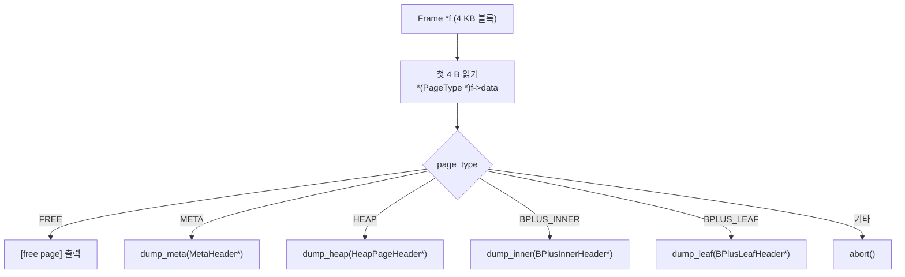

C++·C#·Java 를 주로 쓰던 배경에서 minidb 를 C 로 짤 때 가장 크게 막혔던 것은, "다형성을 어떻게 표현할까" 였습니다.

B+ tree 의 노드는 내부 노드(internal) 일 수도 잎 노드(leaf) 일 수도 있습니다. 디스크에 저장되는 페이지는 데이터 힙 페이지일 수도, B+ tree 노드 페이지일 수도, 메타데이터 페이지일 수도 있습니다. OOP 에서라면 당연히 클래스 계층을 만들고 가상 함수 테이블로 다형성을 구현했을 일입니다.

C 에는 그런 장치가 없습니다. 처음엔 거부감이 컸습니다. "타입이 자기 자신을 모르면 어떻게 다른 행동을 할 수 있지?"

그런데 minidb 를 설계하다 보니 C 가 오히려 더 담백한 답을 제시했습니다. 페이지 자체에 자기 타입을 새겨 넣습니다. 그게 전부였습니다.

## page_type 태그 — 모든 페이지의 첫 4 바이트

모든 페이지는 첫 4 바이트에 자신이 어떤 종류인지를 기록합니다.

```c
typedef enum : uint32_t {
    PAGE_TYPE_FREE         = 0,
    PAGE_TYPE_META         = 1,
    PAGE_TYPE_HEAP         = 2,
    PAGE_TYPE_BPLUS_INNER  = 3,
    PAGE_TYPE_BPLUS_LEAF   = 4,
} PageType;
```

모든 페이지 구조체의 맨 앞에 이 값이 박힙니다.

```c
typedef struct {
    PageType type;      // 공통 헤더: 반드시 맨 앞
    uint16_t slot_count;
    uint16_t free_start;
    uint16_t free_end;
    uint16_t reserved;
    uint8_t  payload[PAGE_SIZE - 16];
} HeapPageHeader;

typedef struct {
    PageType type;      // 공통 헤더
    uint16_t n_keys;
    uint16_t is_root;
    uint32_t right_sibling;
    uint8_t  payload[PAGE_SIZE - 16];
} BPlusLeafHeader;

typedef struct {
    PageType type;      // 공통 헤더
    uint16_t n_keys;
    uint16_t is_root;
    uint32_t first_child;
    uint8_t  payload[PAGE_SIZE - 16];
} BPlusInnerHeader;
```

`__attribute__((packed))` 로 패딩을 막아 디스크 레이아웃을 고정시켰습니다.

## switch 기반 디스패치 — 페이지를 올바르게 해석하기

페이지 하나를 처리하는 함수가 필요할 때, 가상 함수가 아니라 `switch` 로 분기했습니다.

```c
void page_dump(Frame *f) {
    PageType t = *(PageType *)f->data;
    switch (t) {
        case PAGE_TYPE_META:
            dump_meta((MetaHeader *)f->data); break;
        case PAGE_TYPE_HEAP:
            dump_heap((HeapPageHeader *)f->data); break;
        case PAGE_TYPE_BPLUS_INNER:
            dump_inner((BPlusInnerHeader *)f->data); break;
        case PAGE_TYPE_BPLUS_LEAF:
            dump_leaf((BPlusLeafHeader *)f->data); break;
        case PAGE_TYPE_FREE:
            printf("[free page]\n"); break;
        default:
            fprintf(stderr, "unknown page type: %u\n", t);
            abort();
    }
}
```

이 `switch` 기반 디스패치 흐름을 시각화하면 다음과 같습니다.



OOP 의 관점에선 "꼭 switch 로 하네" 라고 안타까워할 수 있습니다. 하지만 여기엔 특별한 성질이 있었습니다.

1. 모든 페이지 타입이 같은 4 KB 블록의 서로 다른 해석입니다. 메모리상으로도 디스크상으로도 크기와 위치와 정렬이 동일합니다.
2. 페이지 타입의 수는 소수이고 드물게 추가됩니다. 가상 함수 테이블을 만들 정도의 확장성이 필요 없습니다.
3. `switch` 안에서 각 case 가 서로 다른 타입으로 캐스팅하지만, 그 캐스팅은 같은 바이트를 다르게 해석하는 것일 뿐입니다.

## OOP 다형성과 C 태그 기반 분기의 차이

이 지점에서 깨달음이 왔습니다. OOP 가 추상화하는 대상과 C 가 추상화하는 대상이 근본적으로 다릅니다.

OOP 는 객체를 추상화합니다. 각 클래스는 자기 데이터와 행동을 캡슐화하며, 같은 인터페이스를 구현하는 여러 구현 타입이 존재합니다. 인터페이스라는 이름 뒤에 실제 타입이 숨습니다.

C 의 페이지 기반 설계는 메모리 블록 자체를 추상화합니다. "4 KB 블록" 이라는 공통 형태가 있고, 그 안의 첫 바이트들이 "이 블록은 지금 어떤 해석으로 읽혀야 하는가" 를 말합니다. 다형성은 같은 바이트를 서로 다른 스키마로 읽을 수 있다는 성질입니다.

OOP 의 추상 단위는 "타입의 identity" 입니다. 이 객체가 A 인지 B 인지를 묻습니다. C 의 이 설계에서 추상 단위는 "블록의 해석" 입니다. 이 바이트 영역을 어떤 구조체로 볼 것인가를 묻습니다.

## 메모리 레이아웃 제어의 의미

OOP 의 클래스 인스턴스는 힙에 흩어집니다. 각각이 자기만의 주소를 갖고 자기만의 바이트를 소유합니다. 객체끼리의 포인터 관계가 객체 그래프를 이룹니다. 추상화는 이 그래프의 노드와 엣지 수준에서 작동합니다.

페이지 기반 설계에서는 모든 것이 같은 크기의 블록입니다. 메모리와 디스크 어디에서든 4 KB 블록의 배열입니다. 객체라는 개념 자체가 해체되고, 남는 것은 "이 블록을 지금 무엇으로 해석할 것인가" 뿐입니다.

블록들 사이의 관계는 페이지 번호(블록의 위치) 로 표현됩니다. 그리고 이 표현은 그대로 디스크에 직렬화됩니다. 포인터 관계가 주소가 아닌 페이지 번호이기에, `memcpy` 한 번으로 디스크에 쓰고 `memcpy` 한 번으로 다시 읽어도 구조가 깨지지 않습니다.

OOP 의 객체 그래프를 디스크에 쓰려면 직렬화라는 별개의 작업이 필요합니다. 포인터를 ID 로 바꾸고, 관계를 기록하고, 읽을 때 다시 객체로 조립합니다. 그 과정이 본질적으로 "영속성을 위한 변환" 입니다. 페이지 기반 설계에서는 영속성과 메모리 표현이 이미 같습니다. 변환이 필요 없습니다.

## 디스크에서도 유효한 태그 값

`page_type` 은 단순히 런타임 디스패치용이 아닙니다. 이 태그가 디스크에 그대로 기록되므로,

- 파일을 다시 열었을 때 각 페이지가 자기 종류를 스스로 압니다.
- 크래시 복구 시 파일을 스캔하며 각 페이지가 어떤 역할이었는지 바로 판정할 수 있습니다.
- `page_type == PAGE_TYPE_FREE` 로 표시된 페이지만 수집하면 빈 페이지 리스트가 즉시 복원됩니다.

메타데이터가 런타임 메모리와 디스크의 경계를 자연스럽게 건넙니다. C++ 에서 이를 하려면 serializer 클래스를 따로 짜서 클래스 ID 를 수동으로 써 넣어야 합니다. 여기서는 같은 구조체의 첫 4 바이트가 그 역할을 합니다.

## 정리

C 에는 클래스도 가상 함수도 없지만, 다형성을 블록의 첫 바이트에 자기 종류를 새겨 넣는 방식으로 표현할 수 있습니다.

`page_type` 태그와 `__attribute__((packed))` 구조체, `switch` 디스패치. 이 세 가지의 조합이 B+ tree 노드와 힙 페이지와 메타 페이지를 같은 프레임 캐시 위에서 돌리고, 같은 `pread` / `pwrite` 로 디스크에 오갈 수 있게 합니다.

OOP 에서 거부감을 느꼈던 이유는 "C 에는 추상화의 수단이 없다" 는 오해였습니다. 실제로는 C 가 다른 계층에서 추상화합니다. 객체 단위가 아니라 메모리 블록 단위의 추상화입니다. 이 관점에 도달한 순간, C 가 시스템 프로그래밍과 데이터베이스·커널 같은 영역에서 왜 오래 살아남는지를 이해하게 됐습니다.
