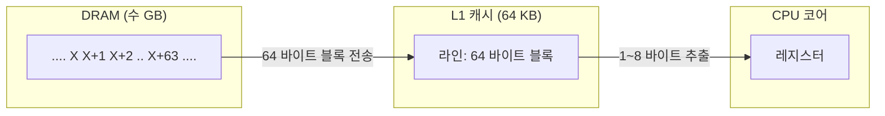
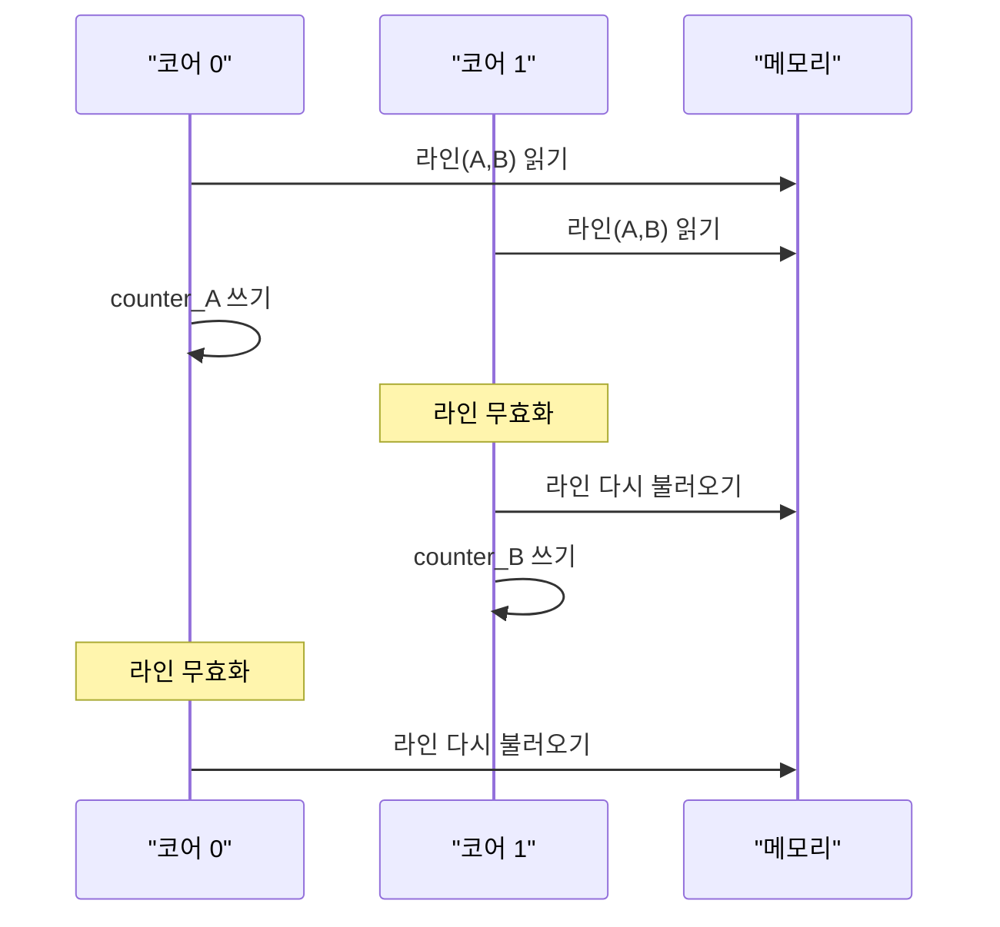

# 캐시 라인 — 보이지 않는 64바이트 단위

CPU와 메모리 사이에서 실제로 움직이는 최소 단위는 바이트가 아니라 `cache line` 입니다.
오늘날 대부분의 x86·ARM 프로세서에서 그 크기는 64바이트입니다.
우리가 "한 바이트를 읽었다"고 생각하는 모든 연산은 물리적으로는 "64바이트 한 블록을 DRAM에서 캐시로 옮기고, 그중 한 바이트를 꺼낸" 것입니다.

## 왜 한 바이트가 아니라 한 라인인가

DRAM 한 번의 접근에는 수백 사이클의 고정 오버헤드가 있습니다.
주소를 row/column으로 풀고, 센스 앰프가 비트 라인을 증폭하고, 버스를 통해 값을 전송하는 과정에서 대부분의 시간이 소모됩니다.
이 비용은 1바이트를 읽든 64바이트를 읽든 거의 차이가 없습니다.
그렇다면 한 번 움직일 때 최대한 많이 가져오는 편이 이득입니다.

공간적 지역성이라는 경험적 사실이 이를 뒷받침합니다.
프로그램이 주소 X를 참조했다면 X+1, X+2, ... 역시 곧 참조될 확률이 높습니다.
배열 순회, 구조체 필드 접근, 스택 프레임의 지역 변수 접근 모두 이 성질을 따릅니다.
그래서 CPU는 "옆 바이트들을 미리 들고 오는" 전략을 택합니다.
그 묶음이 `cache line`입니다.

64바이트라는 숫자는 이 두 요구 — DRAM 전송 효율과 지역성 활용 — 의 타협입니다.
너무 작으면 DRAM 버스가 놀고, 너무 크면 필요 없는 데이터까지 옮기느라 대역폭을 낭비합니다.

## 메모리에서 캐시까지의 흐름



CPU가 주소 X를 요청하면,

1. X를 포함하는 라인의 시작 주소가 계산됩니다. X를 64로 나눠 내림한 값입니다.
2. 그 라인이 L1에 있으면 hit, 없으면 miss.
   miss면 L2, L3, DRAM 순으로 찾습니다.
3. 최종적으로 64바이트 라인이 L1에 올라오고, 그 안의 해당 바이트가 레지스터로 이동합니다.

여기서 중요한 사실은 "주소 X를 읽었다"는 명령이 라인 전체의 이동을 강제한다는 점입니다.
이후 X+1, X+2를 읽는 접근은 이미 올라온 라인에서 꺼내므로 사실상 공짜에 가깝습니다.

## 지역성 두 종류

지역성은 성능 예측의 언어입니다.

- 시간적 지역성(Temporal Locality): 한 번 접근한 데이터는 곧 다시 접근됩니다. 캐시에 살아 있는 동안 다시 쓰면 hit.
- 공간적 지역성(Spatial Locality): 한 번 접근한 데이터의 이웃 주소가 곧 접근됩니다. 같은 라인 안이라면 hit.

```c
// 공간적 지역성을 따르는 순회 — fast
for (int i = 0; i < N; i++) {
    sum += arr[i];                // arr[0..15]는 한 라인에
}

// 공간적 지역성을 깨는 순회 — slow
for (int j = 0; j < M; j++) {
    for (int i = 0; i < N; i++) {
        sum += matrix[i][j];      // 열 방향 → 매번 다른 라인
    }
}
```

C의 행 우선(row-major) 배열 저장 방식을 떠올려 봅시다.
`matrix[i][j]`를 `j`를 바깥 루프로 돌리는 순간 매 접근마다 라인을 새로 불러옵니다.
같은 연산인데 5~10배 느려지는 일이 흔합니다.

## False Sharing — 여러 코어가 같은 라인을 공유하면

`cache line`은 성능의 축복이지만, 멀티스레드 환경에서는 오히려 저주가 되기도 합니다.
두 스레드가 서로 다른 변수를 쓰더라도 그 두 변수가 같은 64바이트 라인 안에 있으면, 한 코어가 쓰는 순간 다른 코어의 캐시에 있는 같은 라인이 무효화됩니다.
이를 거짓 공유(False Sharing) 라고 합니다.

```
              캐시 라인 하나 (64 Bytes)
┌────────────────────┬────────────────────┬──────────┐
│     counter_A      │     counter_B      │   ...    │
│   (core 0만 write) │   (core 1만 write) │          │
└────────────────────┴────────────────────┴──────────┘

 한 라인을 공유하므로 다음이 반복됨:
   core 0 write → core 1 cache invalidate
   core 1 write → core 0 cache invalidate
   → 매번 DRAM 왕복
```



해결법은 두 변수를 서로 다른 라인으로 떨어뜨리는 것입니다. 많은 시스템 코드가 핫 카운터를 64바이트 경계로 정렬하거나 패딩을 삽입하는 이유가 여기에 있습니다.

```c
struct counters {
    _Atomic long a;
    char pad[64 - sizeof(long)];   // 다음 라인으로 밀어낸다
    _Atomic long b;
} __attribute__((aligned(64)));
```

## 정렬(Alignment)과 라인의 관계

한 객체가 두 라인에 걸쳐 있으면(line-split) 한 번의 읽기가 두 라인을 fetch합니다.
이를 피하기 위해 컴파일러는 자연 정렬(natural alignment)을 적용하고, 프로그래머는 핫 데이터를 라인 경계에 맞추는 선택을 합니다.
`alignas(64)`, `__attribute__((aligned(64)))`, `posix_memalign` 같은 도구가 이 목적으로 쓰입니다.

## 정리

`cache line`은 CPU가 메모리를 보는 해상도입니다.
바이트 단위로 생각하고 코드를 짜도, 실행 시점에는 언제나 64바이트 단위로 일이 벌어집니다.
배열이 연결 리스트보다 빠른 이유, 구조체 필드 순서가 성능에 영향을 주는 이유, 멀티스레드에서 서로 다른 변수인데 느려지는 이유가 모두 라인에서 설명됩니다.
좋은 성능은 언제나 라인 경계와의 관계 속에서 만들어집니다.
