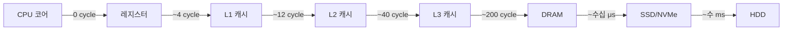
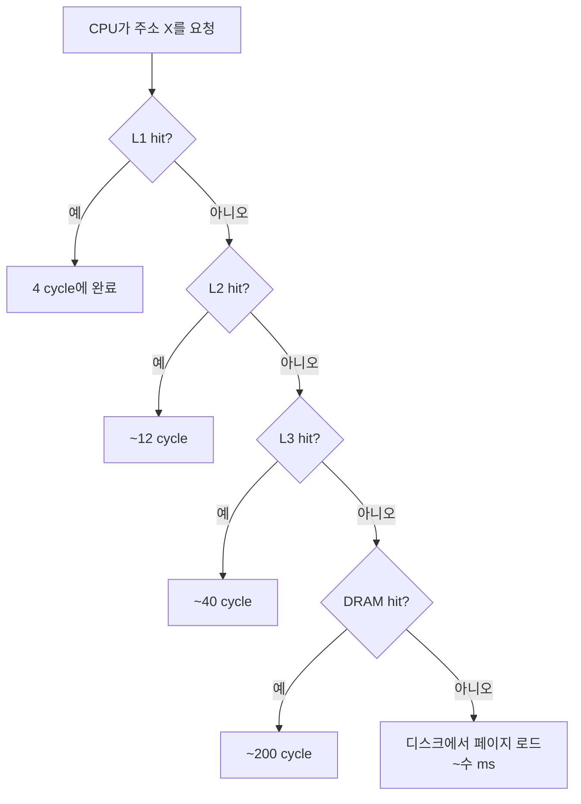

# 메모리 계층은 물리의 필연일까

CPU는 한 사이클에 모든 메모리에 접근할 수 없습니다.
더 빠른 메모리는 더 비싸고 더 작습니다.
더 큰 메모리는 더 멀고 더 느립니다.
이 물리적 제약이 오늘날 우리가 쓰는 모든 컴퓨터를 메모리 계층(Memory Hierarchy) 구조로 만듭니다.

## 왜 이 구조를 받아들일 수밖에 없는가

전자가 도체 안에서 움직일 수 있는 속도에는 상한이 있습니다.
CPU 클럭이 3 GHz라면 한 사이클은 약 0.33 ns이고, 그 동안 빛이 진공에서 갈 수 있는 거리는 약 10 cm입니다.
데이터는 CPU 코어 내부에서 나와 메인 메모리 모듈까지 왕복해야 하는데, 거리만으로도 수십 사이클이 사라집니다.
여기에 DRAM 셀을 재충전하는 시간, 신호를 정렬하는 시간이 더해지면 DRAM 접근 한 번은 수백 사이클에 이릅니다.

그런데 메모리 전부를 SRAM으로 만들 수는 없습니다.
SRAM 한 비트는 트랜지스터 6개로 구성되는 반면 DRAM 한 비트는 트랜지스터 1개와 캐패시터 1개로 구성됩니다.
면적·전력·원가 모두 SRAM이 한 자릿수 이상 비쌉니다.
그래서 시스템은 빠른 메모리는 소량만 CPU 옆에 두고, 느린 메모리는 대용량을 멀리 둡니다.
이 타협이 바로 계층입니다.

## 계층의 모습

```
         ┌─────────────────────────────┐
         │  Registers   ~ 수십 바이트   │  0 cycle
         ├─────────────────────────────┤
         │  L1 Cache    ~ 32 KB         │  ~4 cycle
         ├─────────────────────────────┤
         │  L2 Cache    ~ 256 KB ~ 1 MB │  ~12 cycle
         ├─────────────────────────────┤
         │  L3 Cache    ~ 수 MB ~ 수십   │  ~40 cycle
         ├─────────────────────────────┤
         │  DRAM        ~ 수 GB ~ 수백   │  ~200 cycle
         ├─────────────────────────────┤
         │  SSD/NVMe    ~ 수백 GB ~ 수 TB│  ~수십 μs
         ├─────────────────────────────┤
         │  HDD         ~ 수 TB          │  ~수 ms
         └─────────────────────────────┘
           위로 갈수록  빠르고 작고 비싸다
           아래로 갈수록 느리고 크고 싸다
```



각 층은 바로 아래 층의 캐시 역할을 합니다.
L1은 L2의 캐시, L2는 L3의 캐시, L3는 DRAM의 캐시, DRAM은 디스크의 캐시입니다.
이 관계는 재귀적입니다.
한 층에서 찾지 못하면 다음 층으로 내려갑니다.

## 각 층의 정체

레지스터(Register) 는 CPU 코어 안에 있는 저장 공간입니다.
x86-64의 범용 레지스터는 16개이며 각각 64비트, 즉 코어당 128바이트 정도입니다.
명령어가 직접 이름으로 지목합니다. 로드·저장 명령 없이 즉시 사용됩니다.

L1 캐시(L1 Cache) 는 코어마다 분리돼 있고, 보통 명령어 캐시(L1i)와 데이터 캐시(L1d)가 따로 있습니다.
크기는 32~48 KB, 히트 지연은 약 4 사이클입니다.
`cache line`(대개 64바이트) 단위로 데이터를 보관합니다.

L2 캐시(L2 Cache) 도 코어별 개인 캐시입니다.
L1보다 크고 느리지만, L1에서 miss가 난 라인을 L2에서 찾습니다.

L3 캐시(L3 Cache, LLC) 는 소켓 안의 모든 코어가 공유하는 마지막 방어선입니다.
멀티코어 캐시 일관성 프로토콜(MESI 등)이 이 층에서 조율됩니다.

DRAM 은 메인보드의 DIMM 슬롯에 꽂히는 모듈입니다.
용량은 GB 단위로 크지만, 캐패시터 기반이라 주기적 재충전(refresh)이 필요하고 접근 지연이 ns 단위입니다.

SSD/HDD 는 전원이 꺼져도 데이터가 유지되는 영속 저장소입니다.
DRAM보다 수만~수십만 배 느립니다.
그래서 운영체제는 디스크의 내용을 DRAM에 캐싱합니다.
이것이 페이지 캐시(Page Cache) 이며 OS의 핵심 메커니즘입니다.

## 단위: 계층마다 다르다

한 번에 이동하는 데이터의 단위가 층마다 다릅니다.

| 층       | 이동 단위                 | 관찰 가능한 단위 |
| -------- | ------------------------- | --------------- |
| 레지스터 | 1~8 바이트                | 바이트          |
| L1~L3    | 캐시 라인 (보통 64 B)     | 64 바이트       |
| DRAM     | 캐시 라인                 | 64 바이트       |
| 디스크   | 페이지 (보통 4 KB)        | 4 KB 블록       |

이 단위의 차이가 성능을 지배합니다.
"한 바이트만 읽어도 실제로는 64바이트가 움직인다"거나 "한 바이트만 고쳐도 실제로는 4 KB가 디스크에서 읽히고 다시 4 KB가 기록된다"는 사실은 코드를 작성하는 순간엔 보이지 않습니다.
하지만 물리적으로는 매 접근마다 일어납니다.

## 프로그래밍에 미치는 영향

계층이 존재하는 한, 성능을 결정하는 것은 접근 패턴입니다.



한 번의 L1 hit과 한 번의 `page fault`는 대략 10^6 배의 성능 차이를 냅니다.
그래서 다음 두 원리가 성립합니다.

- 시간적 지역성(Temporal Locality): 방금 쓴 데이터는 곧 다시 쓰입니다. 쓴 직후에 캐시에 살아 있다면, 재접근이 쌉니다.
- 공간적 지역성(Spatial Locality): 쓴 데이터 옆에 있는 데이터도 곧 쓰입니다. 한 캐시 라인이 올라올 때 주변 바이트들이 같이 올라오므로, 인접 주소를 연속으로 접근하면 공짜로 따라온 데이터를 활용할 수 있습니다.

두 지역성을 가지도록 자료구조를 배치하고 코드를 배열하는 일이 캐시 친화적인 프로그래밍입니다.
연결 리스트 대신 배열, 이중 포인터 대신 구조체 배열(AoS/SoA 선택), 랜덤 접근 대신 순차 접근이 일관되게 빠른 이유가 이 계층 때문입니다.

## 정리

메모리 계층은 선택이 아니라 물리의 결과입니다.
작고 빠른 것과 크고 느린 것은 함께 존재할 수 없으므로, 시스템은 작고 빠른 층이 크고 느린 층의 캐시가 되도록 타협합니다.
프로그래머가 쓰는 "메모리 접근 한 번"은 실제로는 6~7층짜리 계층을 위에서부터 차례로 두드리는 행위입니다.
그 중 어느 층에서 "있다"는 응답이 오느냐가 성능을 결정합니다.
그리고 그 응답을 유리하게 만드는 유일한 레버는 접근 패턴을 지역성에 맞추는 것뿐입니다.
