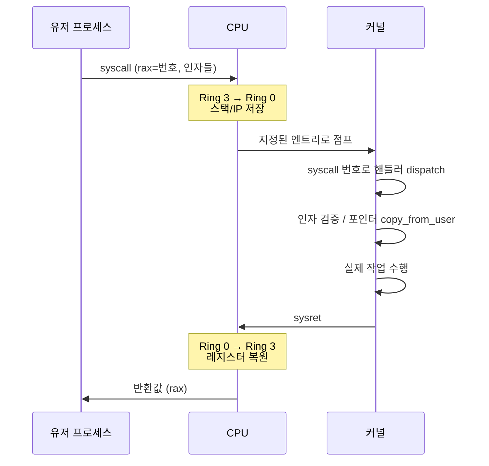

# 특권 모드와 System Call의 경계

CPU는 모든 명령어를 자유롭게 실행할 수 있도록 만들어져 있지 않습니다.
실행 권한이 둘로 나뉘어 있고, 한쪽 모드에서만 특권 명령어(페이지 테이블 조작, I/O 포트 제어, 인터럽트 벡터 변경 등)를 쓸 수 있습니다.
이 구분이 `User Mode` 와 `Kernel Mode` 입니다.
사용자 프로그램이 커널의 기능을 쓰려면 중간에 이 경계를 안전하게 건너가야 하며, 그 건너감의 공식 창구가 `system call`(시스템 콜) 입니다.

## 모드 분리의 이유

운영체제가 안전성과 공정성을 유지하려면 한 프로세스가 다른 프로세스의 메모리나 장치를 임의로 건드릴 수 없어야 합니다.
이를 소프트웨어만으로 보장하려면 OS가 모든 명령을 일일이 검사해야 하는데, 그러면 성능이 불가능합니다.
그래서 하드웨어가 한 비트로 "지금 커널이 실행 중인가, 사용자 프로그램이 실행 중인가"를 표현하고, 커널이 아니면 위험 명령을 거부합니다.

| Ring | 모드 | 특권 |
|------|------|------|
| Ring 0 | Kernel Mode | O (특권 명령 실행 가능) |
| Ring 3 | User Mode | X (특권 명령 불가) |

> Ring 1·2는 거의 쓰이지 않음

Ring 0에서만 허용되는 명령어의 예:

- `lgdt`, `lidt` — GDT/IDT (디스크립터 테이블) 적재
- `CR0` · `CR3` 등 제어 레지스터 쓰기
- `in`, `out` — I/O 포트 접근
- `hlt`, `cli` / `sti` — 인터럽트 제어

사용자 모드에서 이 명령을 실행하려고 하면 CPU는 일반 보호 예외를 던지고, 커널이 해당 프로세스를 종료시킵니다.

## 주소 공간의 분리

여기서 흥미로운 점은 각 프로세스의 가상 주소 공간 안에는 유저 영역과 커널 영역이 함께 매핑돼 있다는 것입니다.
x86-64의 일반적 배치는 다음과 같습니다.

```
      가상 주소 공간 (프로세스 하나의 것)
 ┌───────────────────────────────────┐ 0xFFFFFFFF...
 │       Kernel Space                │  ← PTE.U = 0
 │       (모든 프로세스가 공유)        │      유저 모드 접근 시 fault
 │                                    │
 ├───────────────────────────────────┤ 0x8000000000000000 근방
 │                                    │
 │       User Space                   │  ← PTE.U = 1
 │       (프로세스마다 다른 매핑)        │
 │                                    │
 └───────────────────────────────────┘ 0x0
```

커널 페이지는 PTE의 `U` 비트가 0입니다.
사용자 모드의 CPU는 이 페이지에 접근하려는 순간 하드웨어가 `fault`를 일으킵니다.
즉 커널은 주소 공간 "위쪽"에 언제나 걸려 있지만, 사용자는 그 주소에 손을 댈 수 없습니다.
커널 모드로 전환된 순간에야 비로소 그 주소가 "살아난다"는 뜻입니다.

## 시스템 콜의 흐름

유저 프로세스가 커널의 기능 (`read`, `write`, `mmap`, `fork` 등)을 필요로 하면, 임의로 커널 코드를 호출할 수는 없습니다.
대신 CPU에 "지금 커널 모드로 들어가 주세요"라는 특별한 명령—전통적으로 `int 0x80`, 현대 x86-64에서는 `syscall`—을 실행합니다.
이 명령은 다음을 한 번에 수행합니다.

1. CPU를 `Kernel Mode` (Ring 0) 로 전환.
2. 유저 스택 포인터·명령 포인터·플래그를 저장.
3. 커널이 미리 지정해 둔 엔트리 포인트 (MSR `LSTAR` 등)에서 실행을 시작.
4. 레지스터에 담긴 시스템 콜 번호와 인자를 커널이 읽어 들여 해당 핸들러를 호출.



리눅스에서 전체 시스템 콜 번호는 수백 개이며 `<asm/unistd.h>`에 정의돼 있습니다.

```c
// 유저 공간에서 write(1, "hi", 2) 호출의 개념 (x86-64 ABI)
//   rax = 1   (SYS_write)
//   rdi = 1   (fd)
//   rsi = ptr to "hi"
//   rdx = 2   (len)
//   syscall
```

## 모드 전환 비용

시스템 콜은 함수 호출과 다릅니다.
매 호출마다 다음 비용이 발생합니다.

- 모드 전환: Ring 전환, 레지스터 저장·복원, TLB·브랜치 예측기 `flush` 가능성.
- 스택 전환: 유저 스택에서 커널 전용 스택으로 전환.
- 인자 검증: 포인터가 유저 영역에 속하는지 확인 후 `copy_from_user`로 커널 메모리로 복사.
  유저가 건넨 포인터가 커널 주소를 가리키면 안 되기 때문입니다.

단순 함수 호출이 수 사이클인 반면 시스템 콜은 수백 사이클에서 수 μs까지 걸립니다.
그래서 고성능 코드는 시스템 콜 수를 줄이려 노력합니다.

- `read` / `write`를 여러 번 부르는 대신 버퍼링합니다 (`stdio`가 하는 일).
- 소켓은 `sendfile` / `splice` 같은 "유저 공간을 거치지 않는" 콜을 씁니다.
- 극단적으로는 `io_uring` 같이 시스템 콜 자체를 큐로 대체하는 API가 등장했습니다.

## 시스템 콜 외의 모드 전환 경로

시스템 콜 외에도 커널 진입 경로는 몇 가지 더 있습니다.
이들 모두 Ring 3 → Ring 0 전환을 동반합니다.

- `Interrupt`: 디스크·네트워크·타이머 같은 하드웨어가 CPU를 멈추고 커널로 점프하게 만듭니다.
- `Exception`: 0으로 나누기, 유효하지 않은 명령어, 페이지 폴트 등 CPU가 자체적으로 발생시키는 이벤트입니다.
  페이지 폴트 처리도 본질적으로 이 경로입니다.
- `System Call`: 프로세스가 명시적으로 커널을 호출합니다.

세 가지 모두 CPU가 `IDT` (Interrupt Descriptor Table) 에 등록된 핸들러로 점프합니다.
커널은 부팅 때 이 테이블을 채워 놓아 어떤 예외가 와도 안전하게 받아낼 준비를 합니다.

## 정리

`User Mode`와 `Kernel Mode`의 분리는 OS의 안전을 소프트웨어가 아니라 하드웨어가 보장하도록 만든 장치입니다.
두 모드의 경계는 엄격하며, 건너가려면 `syscall`이나 예외/인터럽트라는 약속된 창구를 거쳐야 합니다.
시스템 콜은 비싸지만, 그 비용이 있기에 프로세스 간 격리와 커널의 권위가 가능해집니다.
고성능 시스템의 오랜 숙제—"시스템 콜을 어떻게 덜 쓸 것인가"—는 이 경계 비용을 실감나게 드러내는 주제입니다.
