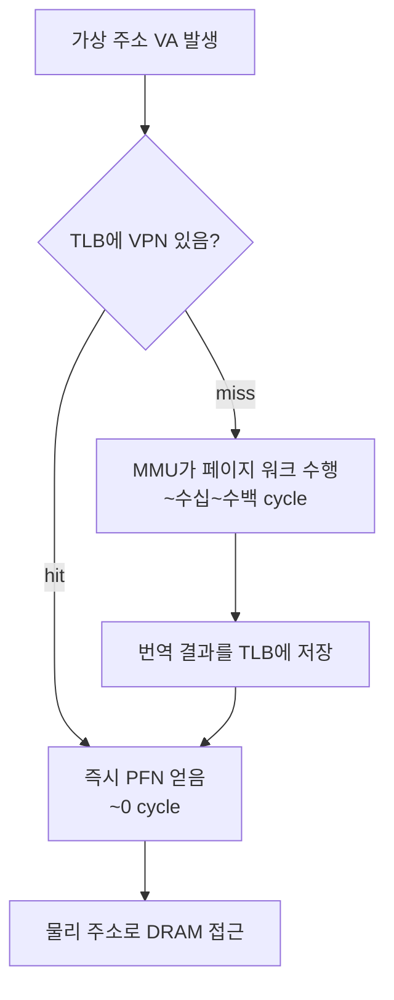
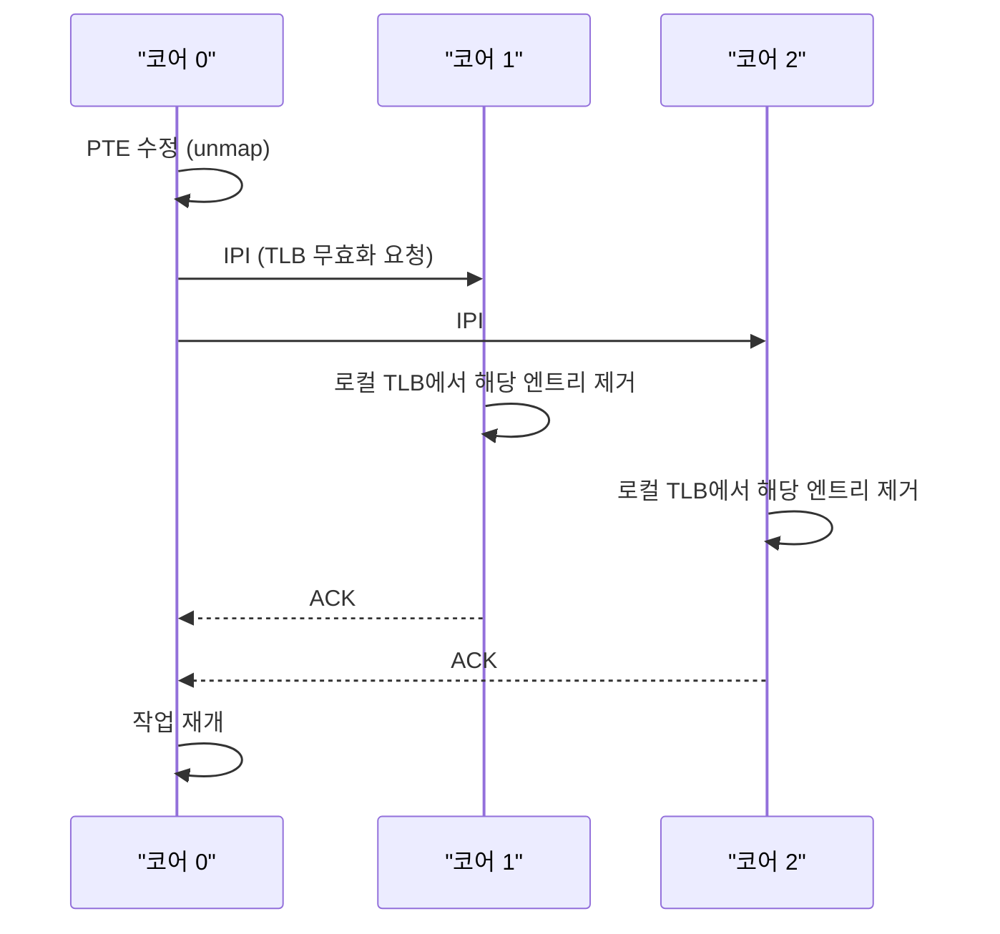

# TLB — 번역 결과를 캐시하다

다단계 페이지 테이블을 한 번 번역하려면 메모리를 네 번 읽어야 합니다.
한 번 메모리 접근이 실은 다섯 번의 메모리 접근으로 부풀어 오르는 이 비용은 현실에서 허용될 수 없습니다.
그래서 CPU에는 번역 결과만을 따로 보관하는 작은 캐시가 있습니다.
이것이 `TLB`(Translation Lookaside Buffer) 입니다.

## TLB가 캐시하는 것

`TLB`는 데이터를 캐시하지 않습니다.
번역 결과 — "이 가상 페이지 번호(VPN)는 이 물리 프레임 번호(PFN)에 대응한다" — 를 캐시합니다.

| 필드 | 예시 값 | 설명 |
|------|---------|------|
| VPN (가상 페이지 번호) | 0x1A2B3C | 조회 키 |
| PFN (물리 프레임 번호) | 0x7F00A | 번역 결과 |
| Flags | RW, U, - | 권한 비트 |

프로세서가 매 메모리 접근마다 먼저 `TLB`를 검사합니다.
hit 이면 PFN을 즉시 얻어 페이지 워크를 건너뜁니다.
miss 이면 MMU가 메모리에 저장된 페이지 테이블을 걸어 내려가 번역을 수행하고, 그 결과를 `TLB`에 적재한 뒤 원래 접근을 완료합니다.



## TLB의 용량과 커버리지

`TLB`는 매 접근마다 조회됩니다.
크기가 클수록 많은 번역을 기억하지만 회로 지연이 늘어 CPU 클럭에 맞추지 못합니다.
실제 x86-64 CPU에서 L1 TLB는 대략 64~128 엔트리, L2 TLB는 수천 엔트리 수준입니다.
라인으로 메모리를 덮는 보통의 캐시와 달리, `TLB` 한 엔트리가 덮는 범위는 페이지 크기인 4 KB입니다.

즉 L1 `TLB` 100 엔트리가 동시에 덮는 범위는 겨우 400 KB 정도입니다.
이보다 큰 작업 집합(working set)을 주기적으로 건드리면 `TLB` miss가 잦아집니다.
huge page(2 MB, 1 GB)가 유리한 이유가 여기에 있습니다.
한 엔트리가 덮는 범위를 늘려 같은 `TLB` 용량으로 더 많은 주소 공간을 커버합니다.

## TLB miss의 비용

`TLB` miss 한 번은 페이지 워크 한 번과 같습니다.
64비트에서는 메모리 접근이 추가로 네 번 필요하지만, 그중 일부는 캐시 히트일 수 있어 실제 지연은 수십~백 사이클 수준입니다.
자주 일어난다면 누적 비용은 걷잡을 수 없이 커집니다.

```
 정상 경로:
   가상주소 → [TLB hit] → 캐시 → 데이터  (~4 cycle)

 miss 경로:
   가상주소 → [TLB miss] → PML4 load → PDPT load → PD load → PT load → TLB 적재 → 재시도
              (메모리 4번, 각 몇~수십 cycle)
```

그래서 고성능 라이브러리는 자료구조를 `TLB`에 친화적으로 배치합니다.
예를 들어, 임의 접근이 많은 해시 테이블은 작업 집합이 `TLB`가 덮는 범위를 넘는 순간부터 눈에 띄게 느려집니다.
B-tree 같은 트리 자료구조가 디스크뿐 아니라 캐시·`TLB` 관점에서도 유리한 이유도 이 연장선입니다.

## 컨텍스트 스위치와 TLB

`TLB`의 엔트리는 현재 프로세스의 번역 결과입니다.
프로세스가 바뀌면 같은 VPN이 다른 PFN을 가리키므로 기존 엔트리는 무효화돼야 합니다.
전통적으로는 CR3를 바꾸는 순간 `TLB` 전체가 비워졌습니다.
이 비용은 컨텍스트 스위치 직후 수백 번의 `TLB` miss로 나타납니다.

이 비용을 줄이기 위해 현대 CPU는 PCID(Process-Context Identifier) 또는 ASID(Address Space Identifier) 를 TLB 엔트리에 포함시킵니다.

| 필드 | 예시 값 | 설명 |
|------|---------|------|
| PCID | 0x07 | 프로세스 식별자 |
| VPN | 0x1A2B3C | 가상 페이지 번호 |
| PFN | 0x7F00A | 물리 프레임 번호 |
| Flags | RW, U, - | 권한 비트 |

PCID는 프로세스마다 할당된 작은 식별자입니다.
`TLB` 조회 시 VPN과 함께 PCID가 일치해야 hit로 인정됩니다.
덕분에 컨텍스트 스위치 시 전체를 비울 필요 없이, 새 프로세스의 PCID에 해당하는 엔트리만 조회되므로 기존 엔트리가 다음 번 이 프로세스로 돌아올 때 재사용됩니다.

## TLB Shootdown — 멀티코어에서의 일관성

멀티코어 환경에서는 각 코어가 자신의 `TLB`를 가집니다.
한 코어가 어떤 페이지의 PTE를 수정하거나 매핑을 제거하면, 다른 코어의 `TLB`에 아직 살아 있는 옛 번역 결과는 무효입니다.
이를 제거하기 위해 커널은 `TLB` Shootdown 이라는 절차를 수행합니다.



IPI(Inter-Processor Interrupt)를 통해 다른 코어들에게 `TLB`의 특정 엔트리를 제거하라고 요청합니다.
이 비용은 코어 수에 비례해 커지며, munmap이나 대규모 페이지 보호 변경이 많은 워크로드에서는 눈에 띄는 오버헤드가 됩니다.

## 정리

`TLB`는 메모리를 덮는 캐시가 아니라 번역 결과를 덮는 캐시입니다.
매 메모리 접근마다 먼저 조회되며, hit가 안 되면 페이지 워크의 비용을 고스란히 칩니다.
한 엔트리가 덮는 범위가 4 KB로 작기에, 작업 집합이 조금만 커져도 miss가 폭발합니다.
huge page, PCID, shootdown 같은 메커니즘은 모두 이 작은 캐시를 조금이라도 효과적으로 쓰기 위해 시스템이 쌓아 올린 장치들입니다.
가상 메모리가 성능적으로 실용적인 이유는 `TLB`가 있기 때문이며, 성능 튜닝이 `TLB`를 염두에 두어야 하는 이유도 같습니다.
