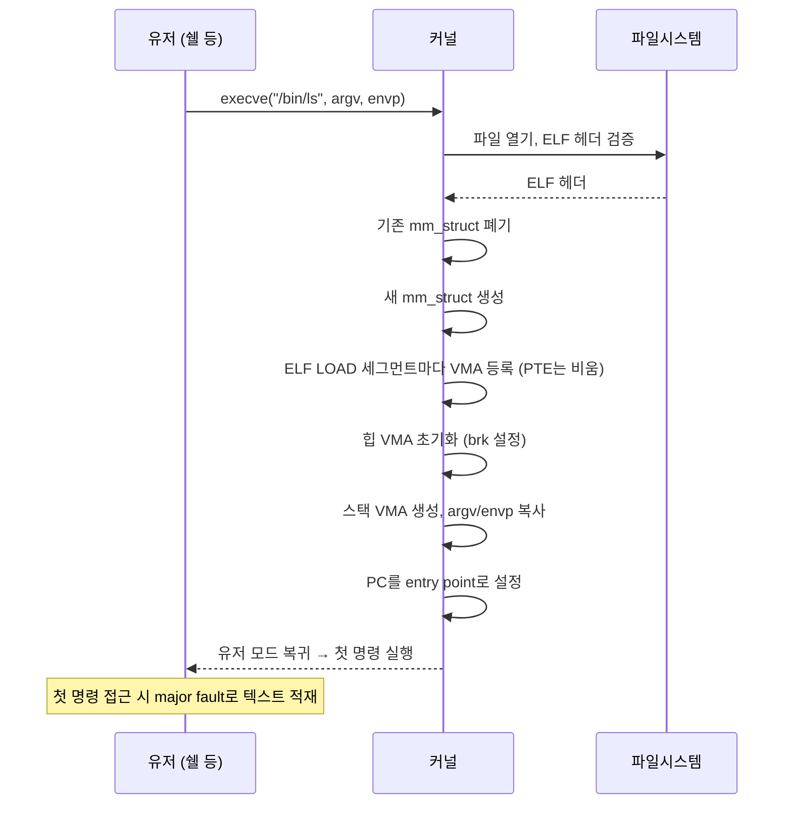

# execve와 ELF 프로그램 로딩

디스크에 있던 실행 파일이 어떻게 CPU 위에서 실행되는 프로세스로 변할까요.
그 전환의 공식 창구가 `execve` 시스템 콜입니다.
`execve`는 단순히 "프로그램을 실행한다"가 아니라 현재 프로세스의 내용을 새 프로그램으로 완전히 교체합니다.
PID와 파일 디스크립터 같은 일부 속성은 유지한 채, 주소 공간·코드·힙·스택이 전부 사라지고 새 프로그램의 것으로 다시 태어납니다.

## execve의 서명

```c
int execve(const char *pathname,
           char *const argv[],
           char *const envp[]);
```

인자는 세 개입니다.
실행할 파일의 경로, 그 프로그램에 전달할 인자 배열, 환경 변수 배열입니다.
호출이 성공하면 이 함수는 돌아오지 않습니다.
왜냐하면 돌아올 "이전 프로세스"가 더 이상 존재하지 않기 때문입니다.

## execve의 처리 과정



커널 내부에서 일어나는 주요 단계는 다음과 같습니다.

1. 파일 검증: 경로에 해당하는 파일을 열고, `ELF` (Executable and Linkable Format) 매직 바이트를 확인합니다.
   아니면 `#!/bin/sh` 같은 스크립트 헤더인지 봅니다.
2. 기존 주소 공간 해체: 현재 프로세스의 `mm_struct`에 속한 모든 VMA와 PTE가 해제됩니다.
   기존 힙·스택·매핑이 전부 사라집니다.
   이 순간 이후 돌아갈 곳이 없습니다.
3. 새 주소 공간 구성: 새 `mm_struct`를 만들고, ELF 파일의 프로그램 헤더에 기록된 각 `LOAD` 세그먼트에 대응해 VMA를 만듭니다.
   보통 text, rodata, data 등이 각각 별도 VMA가 됩니다.
4. 스택 배치와 인자 복사: 스택용 VMA를 만들고, 그 꼭대기에 `argv[]`, `envp[]`, 그리고 보조 벡터 (auxiliary vector, `auxv`)를 복사합니다.
5. 힙 초기화: `mm_struct->start_brk`와 `brk`를 새 프로그램에 맞게 설정해 빈 힙을 준비합니다.
6. 프로그램 카운터 설정: CPU의 명령 포인터를 ELF 헤더에 기록된 `entry point`로 설정합니다.
   이 주소는 보통 `_start`라는 라이브러리 초기화 루틴을 가리키고, 그것이 결국 `main`을 호출합니다.
7. 유저 모드 복귀: 시스템 콜이 반환하는 것이 아니라, 새 프로그램의 첫 명령어로 점프합니다.

## ELF 헤더의 주요 정보

`ELF` 파일은 크게 세 부분으로 구성됩니다.

```
 ┌───────────────────────────────────────────────┐
 │  ELF Header                                    │
 │   - 매직 바이트, 클래스(32/64), 엔디안          │
 │   - entry point 가상 주소                      │
 │   - Program Header 테이블의 위치/개수          │
 │   - Section Header 테이블의 위치/개수          │
 ├───────────────────────────────────────────────┤
 │  Program Header Table  (로더가 본다)           │
 │   - LOAD 세그먼트: 어떤 파일 바이트를 어디에    │
 │     얹을지, 권한은, 정렬은                     │
 │   - INTERP: 동적 링커의 경로                   │
 │   - DYNAMIC, NOTE 등                           │
 ├───────────────────────────────────────────────┤
 │  Sections  (링커가 본다: .text, .data, ...)    │
 ├───────────────────────────────────────────────┤
 │  Section Header Table                          │
 └───────────────────────────────────────────────┘
```

로더는 Program Header만 봅니다. 각 `LOAD` 세그먼트에는 다음이 쓰여 있습니다.

- 파일 오프셋: 이 세그먼트가 ELF 파일 안 어느 바이트부터 시작하는가.
- 가상 주소: 어느 가상 주소에 매핑할 것인가.
- 파일 크기 / 메모리 크기: 메모리 크기가 파일 크기보다 크면 그 차이만큼 BSS(0-채움)로 간주.
- 권한: r/w/x.

커널은 이 정보를 VMA로 옮겨 담습니다.
파일의 바이트는 즉시 메모리에 복사되지 않습니다.
`mmap`과 같은 지연 매핑이 걸려 있어, CPU가 해당 주소를 처음 접근하는 순간의 major fault로 4 KB씩 올라옵니다.
이것이 프로그램 로딩이 빠른 이유입니다.
실행 파일이 100 MB라도 첫 명령어에 해당하는 4 KB만 있으면 실행이 시작됩니다.

## 동적 링커의 개입

대부분의 실행 파일은 공유 라이브러리 (`libc.so`, `libm.so` 등)에 의존합니다.
이들은 ELF 파일 안에 포함되지 않습니다.
대신 ELF 헤더의 `INTERP` 섹션에 동적 링커 (Dynamic Linker) 의 경로 (보통 `/lib64/ld-linux-x86-64.so.2`)가 쓰여 있습니다.

커널은 `execve` 마지막 순간에 CPU의 `entry point`를 사용자 프로그램의 `_start`가 아니라 동적 링커의 `_start`로 설정합니다.
동적 링커가 먼저 실행되어,

1. 의존하는 모든 `.so` 파일을 찾아 `mmap`으로 주소 공간에 올리고,
2. 심볼 해석 (relocation)을 수행해 각 호출이 올바른 함수를 가리키도록 고치고,
3. 필요한 초기화 함수 (`.init_array`)를 호출한 뒤,
4. 그제서야 진짜 사용자 프로그램의 `_start`로 점프합니다.

그래서 `execve` 직후 `/proc/[pid]/maps`를 찍어 보면 프로그램 자신의 매핑뿐 아니라 수많은 라이브러리 매핑이 함께 보입니다.

## argv, envp의 스택 배치

프로그램이 시작될 때 `main(int argc, char **argv, char **envp)`로 받게 되는 배열들은 커널이 스택 최상단에 미리 배치해 둔 것입니다.

```
 스택 최상단 (높은 주소)
 ┌──────────────────────────────┐
 │     환경 변수 문자열들          │  "PATH=/usr/bin"\0 등
 ├──────────────────────────────┤
 │     argv 문자열들              │  "ls"\0 "-l"\0 ...
 ├──────────────────────────────┤
 │     Auxiliary Vector (auxv)    │  AT_PHDR, AT_BASE, AT_RANDOM 등
 ├──────────────────────────────┤
 │     envp 포인터 배열            │
 ├──────────────────────────────┤
 │     argv 포인터 배열            │
 ├──────────────────────────────┤
 │     argc                       │
 └──────────────────────────────┘
 스택 바닥 (더 낮은 주소)
```

`_start`는 이 스택에서 `argc`, `argv`, `envp`를 꺼내 `main`에 전달합니다. 프로그램 실행 전부터 이 정보가 가상 주소 공간에 이미 놓여 있다는 사실이 흥미롭습니다.

## fork와 exec의 역할 분리

유닉스 계열 OS는 "프로그램을 실행한다"는 행위를 `fork` + `execve`의 두 단계로 분리합니다.

- `fork`: 프로세스를 복제합니다.
  주소 공간을 COW로 공유하는 똑같은 자식이 생깁니다.
- `execve`: 그 자식의 주소 공간을 교체합니다.

이 분리 덕분에 부모가 파이프·파일 디스크립터·환경 변수를 조정한 뒤 자식이 그 상태로 새 프로그램을 실행하는 일이 자연스럽게 됩니다.
쉘 리다이렉션 (`>`, `|`)이 작동하는 기반이 이 분리이며, `fork`로 만든 빈 그릇에 `execve`로 내용을 붓는 패턴은 수십 년간 유닉스의 프로세스 모델을 지탱해 왔습니다.

## 정리

`execve`는 프로세스를 "만드는" 시스템 콜이 아닙니다.
기존 프로세스를 새 프로그램으로 교체하는 시스템 콜입니다.
ELF 헤더를 읽고, 옛 주소 공간을 버리고, 새 VMA들을 세우고, 인자와 환경을 스택에 배치하고, 동적 링커로 점프합니다.
그 후의 모든 코드와 데이터는 실제 접근이 일어나는 순간에야 페이지 폴트를 통해 디스크에서 올라옵니다.
실행 파일이 "살아 있는 프로세스"로 변하는 이 일련의 절차 전체가 `execve` 한 호출에 압축되어 있습니다.
