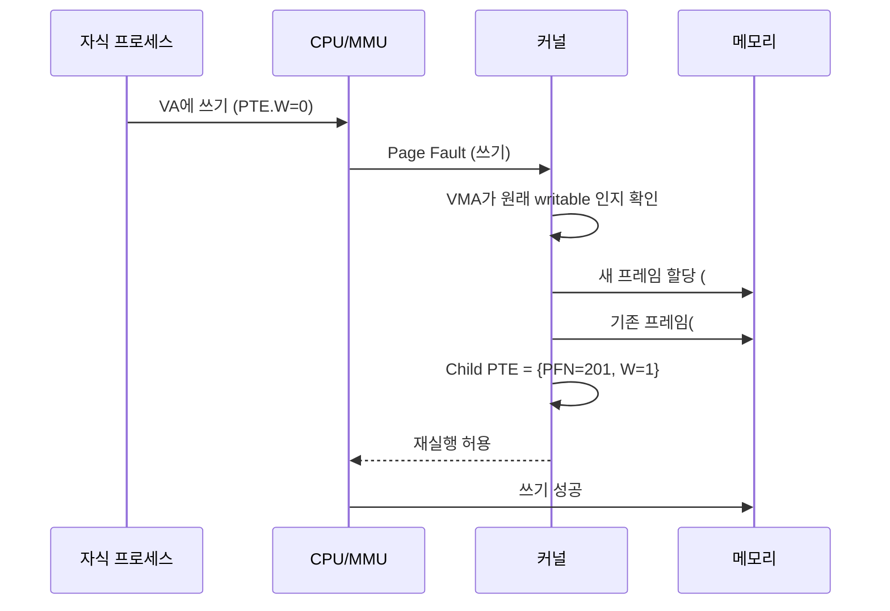

# Copy-on-Write의 동작 원리

두 프로세스가 같은 메모리 내용을 가지고 싶을 때, 가장 단순한 해법은 모든 페이지를 그대로 복사하는 것입니다.
하지만 대부분의 경우 두 쪽 중 한쪽이 실제로 수정하는 페이지는 얼마 되지 않습니다.
미리 전부 복사하는 일은 낭비입니다.
그래서 현대 OS는 공유로 시작하고, 쓰기가 일어나는 순간에만 복사합니다.
이 전략이 `Copy-on-Write` (COW) 입니다.

## COW의 원리

페이지를 복사해야 할 두 개체—예를 들어 부모 프로세스와 `fork`로 만든 자식 프로세스—가 있다고 합시다.
OS는 처음에 다음과 같이 합니다.

1. 자식의 페이지 테이블을 만들고, 부모와 똑같은 PFN을 가리키도록 PTE를 채웁니다.
   즉 프레임은 한 개, PTE는 두 개.
2. 양쪽 PTE 모두를 `W=0` (쓰기 불가)으로 표시합니다.
3. 그런데 커널의 VMA 메타데이터에서는 이 페이지가 실제로는 쓰기 가능해야 한다는 사실을 기억합니다.
   "진짜로 읽기 전용"이 아니라 "COW 중" 이라는 표식을 둡니다.

이 상태에서 읽기는 두 쪽 모두 아무 문제 없이 동작합니다.
하드웨어는 `W=0` 비트를 신경 쓰지 않고 읽기를 허용하기 때문입니다.

```
 초기 상태 (fork 직후)

    Parent PTE                Child PTE
 ┌─────────────┐           ┌─────────────┐
 │ PFN=100, W=0│           │ PFN=100, W=0│
 └─────────────┘           └─────────────┘
          ↘                       ↙
            ┌───────────────┐
            │ Physical Frame │
            │     #100       │
            └───────────────┘
     (한 프레임을 두 프로세스가 공유)
```

## 쓰기 시 분리 과정

그런데 자식이 이 페이지에 쓰기를 시도합니다.
하드웨어는 PTE의 `W=0`을 보고 페이지 폴트를 발생시킵니다.
커널의 폴트 핸들러가 깨어납니다.

1. 폴트 주소가 속한 VMA를 확인해 "이 영역은 원래 쓰기 가능해야 하는 COW 페이지"임을 알아챕니다.
2. 새 물리 프레임을 하나 할당합니다.
3. 기존 프레임(#100)의 내용을 새 프레임(#201)으로 `memcpy`합니다.
4. 자식의 PTE를 새 프레임으로 갱신하고 `W=1`로 되돌립니다.
5. 기존 프레임을 참조하는 쪽이 이제 하나뿐이라면, 그쪽의 PTE도 `W=1`로 되돌릴 수 있습니다.
6. 폴트를 일으킨 명령을 재실행합니다.
   이번엔 쓰기가 성공합니다.



## 분리가 발생하는 시점

COW의 핵심은 "원래 공유였지만 쓰기 시점에 분리한다"는 의미의 전환입니다.
그런데 여기서 주의할 점이 있습니다.
모든 COW 페이지가 곧바로 분리되는 것은 아닙니다.

- 자식이 그 페이지를 한 번도 쓰지 않으면?
  프레임은 끝까지 공유된 채로 자식이 종료됩니다.
  복사 비용 없이 공유의 이득만 남습니다.
- 부모만 쓰고 자식은 안 쓴다면?
  폴트는 부모 쪽에서 한 번 발생하고, 자식은 기존 프레임을 그대로 유지합니다.
- 둘 다 쓴다면?
  두 번의 폴트가 발생하고 결국 각자의 프레임을 갖게 됩니다.

즉 COW는 "얼마나 쓸지 모를 때" 가장 효과적입니다.
실제 쓰는 만큼만 비용을 지불하는 과금 모델입니다.

## 참조 카운트 관리

OS는 각 물리 프레임마다 참조 횟수 (refcount) 를 유지합니다.
`fork`로 자식이 생기면 공유 프레임의 refcount가 1 증가하고, COW로 프레임이 분리되거나 어느 쪽 프로세스가 종료되면 감소합니다.
refcount가 0이 되면 프레임이 free pool로 돌아갑니다.
이 작은 숫자 하나가 "지금 이 프레임을 몇 개의 프로세스가 공유하고 있는가"를 추적하는 핵심 상태입니다.

```
   Physical Frame 구조체 (리눅스 struct page 개념)
┌─────────────────────────────────────────────┐
│ PFN  : 100                                   │
│ refcount : 2   ← fork 직후 부모+자식         │
│ flags    : ...                               │
└─────────────────────────────────────────────┘
       ↓ 자식이 쓰기 → 새 프레임으로 분리
┌─────────────────────────────────────────────┐
│ PFN  : 100                                   │
│ refcount : 1   ← 부모만 남음                 │
└─────────────────────────────────────────────┘
```

## fork 이외의 COW 활용

흥미로운 점은 COW가 `fork` 전용 기법이 아니라는 것입니다.
같은 발상이 여러 곳에 활용됩니다.

- `mmap` + `MAP_PRIVATE`: 파일을 읽기 전용으로 올린 뒤, 쓰기는 자기 사본에만 반영합니다.
  파일 내용을 읽다가 수정이 필요한 페이지만 복사.
- `KSM` (Kernel Samepage Merging): 내용이 같은 여러 프레임을 하나로 병합하고 COW로 표식합니다.
  많은 동일 VM을 돌리는 호스트에서 메모리 절약.
- `Zygote` 패턴: 안드로이드의 `Zygote` 프로세스가 미리 초기화된 런타임을 가진 채 대기하고 있다가, 새 앱 실행 시 `fork`로 자식을 만듭니다.
  자식은 공통 런타임을 COW로 공유해 초기화 비용과 메모리 사용량을 모두 줄입니다.

## 비용과 한계

COW도 완벽하지는 않습니다.

- 첫 쓰기마다 폴트가 발생합니다.
  쓰기 패턴이 분산돼 있다면 수많은 폴트가 누적됩니다.
- 복사가 결국 일어난다면, 비용이 뒤로 밀릴 뿐 사라지지는 않습니다.
  쓰기 직후 바로 페이지 전체를 건드리는 워크로드는 COW의 이득이 거의 없습니다.
- 보안 취약점의 원천이 되기도 합니다.
  과거 리눅스의 `Dirty COW` (CVE-2016-5195)는 폴트·복사·PTE 갱신의 경합을 악용해 읽기 전용 파일을 쓸 수 있게 만든 사건입니다.

## 정리

`Copy-on-Write`는 "미리 복사하지 않고, 필요해질 때까지 공유한다"는 설계입니다.
페이지 테이블의 `W` 비트와 페이지 폴트라는 두 메커니즘을 엮어, 하드웨어가 쓰기를 시도하는 순간에만 커널이 복사를 실행하도록 만듭니다.
덕분에 `fork`, `mmap`, KSM 같은 기능이 공유의 이점을 얻으면서도 독립성을 유지합니다.
COW는 가상 메모리 시스템이 제공하는 가장 낮은 비용의 복제이며, 현대 OS의 상호 작용 구조 대부분이 이 장치 위에 세워져 있습니다.
