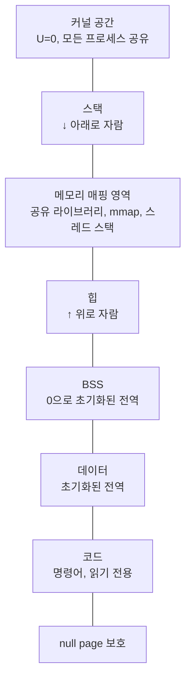

# 프로세스 주소 공간 레이아웃

프로세스는 자신의 가상 주소 공간을 가지며, 그 공간은 임의로 배열되어 있지 않습니다.
컴파일러·링커·로더·커널이 합의한 정해진 레이아웃을 따릅니다.
이 레이아웃을 이해하면 "왜 스택 변수 주소는 값이 크고, 힙은 작고, 문자열 리터럴은 어디 있는지", "왜 코드는 수정할 수 없는지", "왜 `main` 바로 위 주소에서 `SIGSEGV`가 나는지"가 한 번에 설명됩니다.

## 64비트 리눅스의 기본 배치

```
 상위 ──▶ ┌────────────────────────────────────┐ 0xFFFFFFFFFFFFFFFF
          │             Kernel Space            │
          │    (모든 프로세스가 공유, U=0)        │
          ├────────────────────────────────────┤ 0xFFFF800000000000
          │         비어 있는 중간 구간           │
          │      (canonical address hole)        │
          ├────────────────────────────────────┤ 0x00007FFFFFFFFFFF
          │              Stack                   │  ↓ 아래로 자람
          │   (함수 호출 프레임, 지역 변수)        │
          ├────────────────────────────────────┤
          │       Memory Mapping Region          │
          │    (공유 라이브러리, mmap, 쓰레드      │
          │     스택, 익명 메모리)                │
          ├────────────────────────────────────┤
          │              Heap                    │  ↑ 위로 자람
          │         (malloc / brk)               │
          ├────────────────────────────────────┤
          │              BSS                     │  (초기화되지 않은 전역/정적)
          ├────────────────────────────────────┤
          │              Data                    │  (초기화된 전역/정적)
          ├────────────────────────────────────┤
          │           Text (Code)                │  (실행 파일의 명령어)
          ├────────────────────────────────────┤
          │       (예약 영역 / null page)         │
 하위 ──▶ └────────────────────────────────────┘ 0x0000000000000000
```

리눅스 x86-64는 48비트 가상 주소를 쓰며, 상위 비트들이 모두 1이거나 모두 0인 주소만 유효합니다.
유효 구간 사이의 비어 있는 영역을 `canonical hole` 이라 부릅니다.

## 각 영역의 정체

### Text (Code)

실행 파일 ELF의 `.text` 섹션이 매핑됩니다.
권한은 `r-x` (읽기·실행 가능, 쓰기 불가).
쓰기 금지이기에 명령어를 임의로 바꿀 수 없습니다.
이 영역이 읽기 전용이라는 사실이 같은 바이너리를 여러 프로세스가 공유하는 것을 가능하게 합니다.
커널은 `fork` 후에도 text 영역의 물리 프레임을 한 벌만 유지한 채 PTE를 공유 매핑합니다.

### Data

초기화된 전역 변수와 `static` 지역 변수가 들어갑니다.
예를 들어 `int g = 42;`처럼 선언한 변수는 data에 42와 함께 올라옵니다.
권한은 `rw-`.
실행 파일 안에 초기값이 그대로 들어 있어 디스크에서 바로 매핑됩니다.

### BSS (Block Started by Symbol)

초기화 없이 선언한 전역·정적 변수들의 영역입니다.
예: `int arr[1024];`
디스크에는 크기 정보만 있고 실제 바이트는 없습니다.
프로세스 시작 시 커널이 이 영역 전체를 0으로 채워 줍니다.
이 초기화는 요구 페이징과 결합해 "필요할 때 0-프레임을 주는" 방식으로 게으르게 수행됩니다.

### Heap

동적으로 크기가 바뀌는 영역입니다.
`malloc`이 이 영역을 관리하며, `brk` / `sbrk` 시스템 콜로 위쪽 경계 (program break)를 움직여 확장합니다.
초기 크기는 작고, 사용량이 늘면 위로 자랍니다.

### Memory Mapping Region

`mmap` 시스템 콜이 매핑을 만드는 구간입니다.
공유 라이브러리 (`libc.so` 등), 파일 매핑, 익명 큰 할당, 쓰레드의 스택 등이 여기에 놓입니다.
힙과 스택 사이의 광활한 구간에서 커널이 빈자리를 찾아 매핑을 배치합니다.

### Stack

함수 호출 프레임, 지역 변수, 반환 주소, 저장된 레지스터가 담깁니다.
위에서 아래로 자라며 자라는 방향은 CPU 아키텍처가 정합니다 (x86-64는 감소 방향).
리눅스는 프로세스 시작 시 스택에 환경 변수와 `argv` 를 미리 배치해 둡니다.

### Kernel Space

상위 절반은 커널 전용이며 모든 프로세스가 공유합니다.
PTE의 `U=0`이므로 유저 모드에서는 접근이 즉시 `fault`로 거절됩니다.
커널이 시스템 콜을 처리하는 동안에는 이 영역이 "살아 있고", 처리가 끝나 유저 모드로 돌아가면 다시 "사용 불가"가 됩니다.
커널은 언제나 주소 공간에 걸려 있지만 권한 검사에 의해 유저에게 보이지 않을 뿐입니다.

## 주소 공간 전체 구조



## 미사용 영역의 역할

이 레이아웃에는 일부러 비워 둔 구간이 있습니다.
스택과 `mmap` 영역 사이, 그리고 힙과 `mmap` 사이에는 상당한 간격이 있으며, 가장 아래 주소 근처에는 `null page` 라 불리는 4 KB 정도의 금지 구간이 있습니다.

- `null page`: 주소 0번지 근처에는 어떤 매핑도 두지 않습니다.
  `NULL` 역참조를 빠르게 잡아내기 위해서입니다.
  값이 0인 포인터를 역참조하면 곧바로 `fault`가 나도록 보장합니다.
- 스택과 `mmap` 사이 간격: 스택이 아래로 자라다가 `mmap` 영역과 충돌하지 않도록 여유를 둡니다.
  커널은 스택 영역에 `guard page` 를 두어 스택 오버플로를 `fault`로 잡습니다.
- `ASLR`을 위한 랜덤성: `Address Space Layout Randomization`으로 각 영역의 시작 주소를 실행마다 약간씩 달리합니다.
  빈 공간은 이 랜덤화의 여지를 제공합니다.

## 주소를 보면 영역이 보인다

프로그램을 실행하며 각 변수의 주소를 출력해 보면 레이아웃이 눈에 들어옵니다.

```c
#include <stdio.h>
#include <stdlib.h>
int g = 42;
int b;
int main(int argc, char **argv) {
    int local = 1;
    int *heap = malloc(sizeof(int));
    printf("text   %p\n", (void*)main);
    printf("data   %p\n", (void*)&g);
    printf("bss    %p\n", (void*)&b);
    printf("heap   %p\n", (void*)heap);
    printf("stack  %p\n", (void*)&local);
    printf("env    %p\n", (void*)environ);
    free(heap);
    return 0;
}
```

출력되는 주소는 대체로 다음 순서를 따릅니다.

```
text   0x55...4000      ← 가장 아래
data   0x55...7000
bss    0x55...7010
heap   0x55...9000
mmap   0x7f8b00000000   ← 공유 라이브러리 등
stack  0x7ffe...        ← 가장 위
```

주소의 앞자리만 봐도 어느 영역에 속하는지 짐작할 수 있습니다.

## `/proc/self/maps` — 커널이 보는 진짜 레이아웃

리눅스에서는 `/proc/[pid]/maps` 파일로 프로세스 주소 공간의 실제 지도를 볼 수 있습니다.
각 줄은 `VMA` (Virtual Memory Area) 하나에 대응합니다.

```
55bcfe3b1000-55bcfe3b2000 r--p 00000000 fd:00 131074 /usr/bin/cat
55bcfe3b2000-55bcfe3b6000 r-xp 00001000 fd:00 131074 /usr/bin/cat
...
7f3d5f9a0000-7f3d5f9c2000 r--p 00000000 fd:00 131084 /lib/x86_64.../libc.so.6
7f3d5f9c2000-7f3d5fb3a000 r-xp 00022000 fd:00 131084 /lib/x86_64.../libc.so.6
...
7ffe1a3e0000-7ffe1a401000 rw-p 00000000 00:00 0        [stack]
```

각 필드는 가상 주소 범위, 권한 (`rwxp/rwxs`), 파일 오프셋, 디바이스, inode, 경로를 의미합니다.
이 파일을 읽으면 자신의 프로세스 주소 공간이 어떻게 생겼는지가 한눈에 보입니다.

## 정리

프로세스 주소 공간은 자유롭게 쓸 수 있는 거대한 바이트 배열이 아니라, 각 영역이 고유한 권한과 용도를 가진 구획입니다.
컴파일러가 어느 섹션에 바이트를 담을지 결정하고, 로더가 어느 가상 주소에 올릴지 결정하고, 커널이 그것을 PTE로 실현합니다.
이 레이아웃을 알고 있으면 버그의 원인을 주소 값만 보고도 추측할 수 있고, 반대로 자료구조의 배치를 의식해 캐시·보안·메모리 효율을 모두 챙기는 설계가 가능해집니다.
