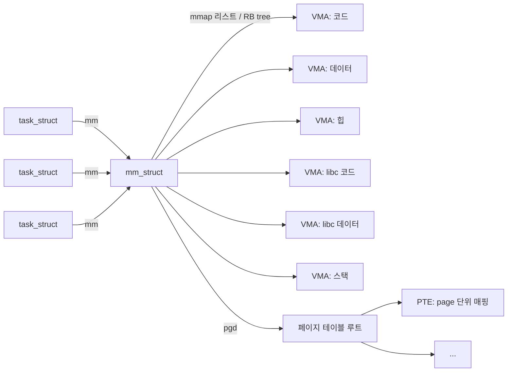

# task_struct, mm_struct, VMA의 계층 구조

프로세스는 유저 입장에선 "실행 중인 프로그램"이지만, 커널 입장에선 자료구조 한 덩이입니다.
리눅스 커널은 각 프로세스를 세 개의 핵심 구조체로 표현합니다.
`task_struct` 는 프로세스 전체를, `mm_struct` 는 그 프로세스의 주소 공간을, `vm_area_struct` (이하 VMA) 는 주소 공간 안의 한 구획을 나타냅니다.
이 세 구조체의 관계를 이해하면, `fork` · `exec` · `mmap` · `brk`가 실제로 무엇을 바꾸는지가 명확해집니다.

## task_struct — 한 프로세스의 모든 것

`task_struct`는 프로세스 하나에 대해 커널이 기억해야 하는 거의 모든 정보를 담습니다.
PID·부모/자식 관계·상태(실행 중/대기 중)·스케줄링 정보·신호·권한(credentials)·파일 디스크립터 테이블·열린 소켓, 그리고 주소 공간 포인터가 여기 들어 있습니다.

```c
struct task_struct {
    pid_t pid;                      // 프로세스 ID
    volatile long state;            // TASK_RUNNING 등
    struct task_struct *parent;     // 부모 프로세스
    struct list_head children;      // 자식 목록
    ...
    struct mm_struct *mm;           // 유저 주소 공간 (NULL이면 커널 쓰레드)
    struct mm_struct *active_mm;    // 현재 사용 중인 주소 공간
    struct files_struct *files;     // 열린 파일 디스크립터
    struct cred *cred;              // uid/gid/capabilities
    ...
};
```

커널의 거의 모든 함수가 "현재 실행 중인 프로세스"를 `current` 라는 매크로를 통해 꺼내 씁니다. `current`는 결국 지금 CPU에서 실행 중인 `task_struct *`입니다.

## mm_struct — 주소 공간 한 벌

주소 공간 자체는 `mm_struct`가 관리합니다.
여기에는 페이지 테이블의 최상단을 가리키는 포인터 (PGD), 주소 공간에 속한 VMA들의 목록, 그리고 `start_code` / `end_code` / `start_data` 같은 섹션 경계 주소가 들어 있습니다.

```c
struct mm_struct {
    struct vm_area_struct *mmap;   // VMA 연결 리스트
    struct rb_root mm_rb;          // VMA 레드-블랙 트리 (주소로 빠른 검색)
    pgd_t *pgd;                    // 최상위 페이지 테이블 물리 주소
    atomic_t mm_users;             // 이 mm을 쓰는 스레드 수
    atomic_t mm_count;             // 커널 참조 포함 refcount
    unsigned long start_code, end_code;
    unsigned long start_data, end_data;
    unsigned long start_brk, brk;  // heap 경계
    unsigned long start_stack;
    ...
};
```

`mm_struct`는 여러 프로세스가 공유할 수 있다는 점이 중요합니다.

- 같은 프로세스의 여러 스레드는 모두 동일한 `mm_struct`를 가리킵니다. 그래서 스레드끼리는 메모리를 공유합니다.
- 다른 프로세스는 자기만의 `mm_struct`를 갖습니다. 그래서 주소 공간이 분리됩니다.

스레드와 프로세스의 차이가 이 한 포인터의 공유 여부로 결정됩니다.

## VMA — 주소 공간 안의 한 구획

한 프로세스의 주소 공간은 연속된 한 덩이가 아니라 여러 구획입니다.
코드 영역, 데이터 영역, 힙, 여러 `mmap` 영역, 스택 등이 각자 다른 시작·끝 주소와 권한을 갖습니다.
이 각각이 VMA (`vm_area_struct`)입니다.

```c
struct vm_area_struct {
    struct mm_struct *vm_mm;        // 소속 mm
    unsigned long vm_start;         // 시작 가상 주소
    unsigned long vm_end;           // 끝 가상 주소 (exclusive)
    unsigned long vm_flags;         // VM_READ / VM_WRITE / VM_EXEC / VM_SHARED / ...
    struct file *vm_file;           // 파일 매핑이면 그 파일, 익명이면 NULL
    unsigned long vm_pgoff;         // 파일 안 오프셋 (페이지 단위)
    struct vm_operations_struct *vm_ops; // 폴트 핸들러 등
    ...
    struct vm_area_struct *vm_next, *vm_prev;  // 이전/다음 VMA
    struct rb_node vm_rb;           // 레드-블랙 트리 노드
};
```

하나의 VMA가 말하는 것은 대체로 이런 내용입니다.
"주소 `0x55...4000`부터 `0x55...8000`까지는 `libc.so` 파일의 `0x1000` 오프셋에서 시작해 읽기 전용·실행 가능으로 매핑된 구간입니다."
PTE가 페이지 단위의 사실을 기록한다면, VMA는 영역 단위의 의도를 기록합니다.

```
   mm_struct의 VMA 리스트
 ┌──────────────────────────────────────────────────┐
 │ VMA₁ [0x55..4000~0x55..5000) r-x  /usr/bin/cat    │  text
 │ VMA₂ [0x55..7000~0x55..8000) r--  /usr/bin/cat    │  rodata
 │ VMA₃ [0x55..8000~0x55..9000) rw-  /usr/bin/cat    │  data
 │ VMA₄ [0x55..9000~0x55..B000) rw-  [heap]          │  heap
 │ VMA₅ [0x7f..0000~0x7f..2000) r--  libc.so          │
 │ VMA₆ [0x7f..2000~0x7f..B000) r-x  libc.so          │
 │ ...                                                │
 │ VMAₙ [0x7ffe..0000~0x7ffe..5000) rw- [stack]       │
 └──────────────────────────────────────────────────┘
```

커널은 이 VMA들을 이중 연결 리스트 (주소 순) 와 레드-블랙 트리 (주소 기반 빠른 검색) 두 가지 방식으로 동시에 관리합니다.
페이지 폴트가 일어나면 커널은 폴트 주소를 키로 레드-블랙 트리를 탐색해 "이 주소가 속한 VMA"를 찾아내고, VMA에 기록된 권한과 매핑 정보를 바탕으로 처리 전략을 결정합니다.

## task_struct, mm_struct, VMA의 관계



같은 `mm_struct`를 여러 `task_struct` (= 스레드)가 공유하고, 한 `mm_struct` 아래에 여러 VMA가 달려 있으며, 실제 번역을 위한 페이지 테이블이 `mm_struct->pgd`로 연결됩니다.
VMA는 "어떻게 매핑해야 하는가의 설계도"이고, 페이지 테이블은 "지금 실제로 매핑된 결과"입니다.

## 시스템 콜과 자료구조 수정

유저가 메모리에 관한 시스템 콜을 호출할 때, 커널이 실제로 하는 일은 이 세 구조체를 고치는 작업입니다.

- `fork`: 새 `task_struct`를 만들고, 부모의 `mm_struct`를 복사해 새 주소 공간을 만든 뒤, 각 VMA의 PTE를 COW로 표시합니다.
- `exec`: 현재 `task_struct`의 `mm_struct`를 완전히 교체합니다.
  기존 VMA들은 모두 사라지고 새 실행 파일에 맞는 VMA들이 생깁니다.
  PID는 그대로입니다.
- `mmap`: 현재 `mm_struct`에 새 VMA를 하나 추가합니다.
  즉시 PTE를 채우지는 않고, 접근 시의 페이지 폴트로 연결을 지연시킵니다.
- `munmap`: 해당 영역의 VMA를 제거하고, 그 안의 PTE들을 정리합니다.
  다른 코어의 TLB도 `shootdown`으로 무효화합니다.
- `brk` / `sbrk`: `mm_struct->brk`의 값을 움직입니다.
  힙 VMA의 끝 주소가 확장되거나 축소됩니다.
- `clone` (스레드 생성): 새 `task_struct`를 만들되 `mm_struct`는 기존 것을 공유합니다.

그래서 "프로세스의 메모리가 바뀐다"는 현상은 본질적으로 이 세 구조체의 상태 변화입니다.

## 정리

리눅스 커널은 프로세스를 세 층의 자료구조로 표현합니다.
`task_struct`는 스케줄 단위, `mm_struct`는 주소 공간 한 벌, VMA는 그 공간의 한 구획입니다.
스레드와 프로세스의 차이도, `fork` · `exec` · `mmap`의 의미도 모두 이 구조체들의 관계로 설명됩니다.
유저 입장의 "메모리 시스템 콜"은 커널 입장에서는 이 객체들을 생성·복제·수정·폐기하는 일이며, 페이지 폴트가 일어났을 때도 커널은 언제나 이 구조체들을 뒤져 처리 방식을 결정합니다.
