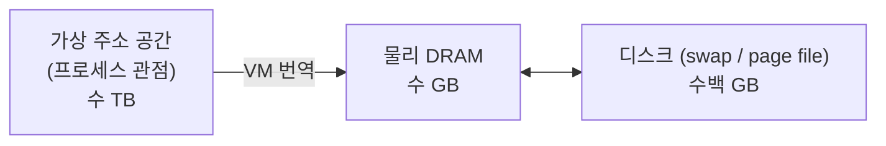
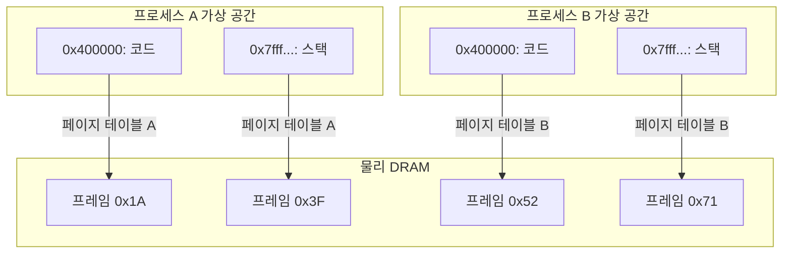
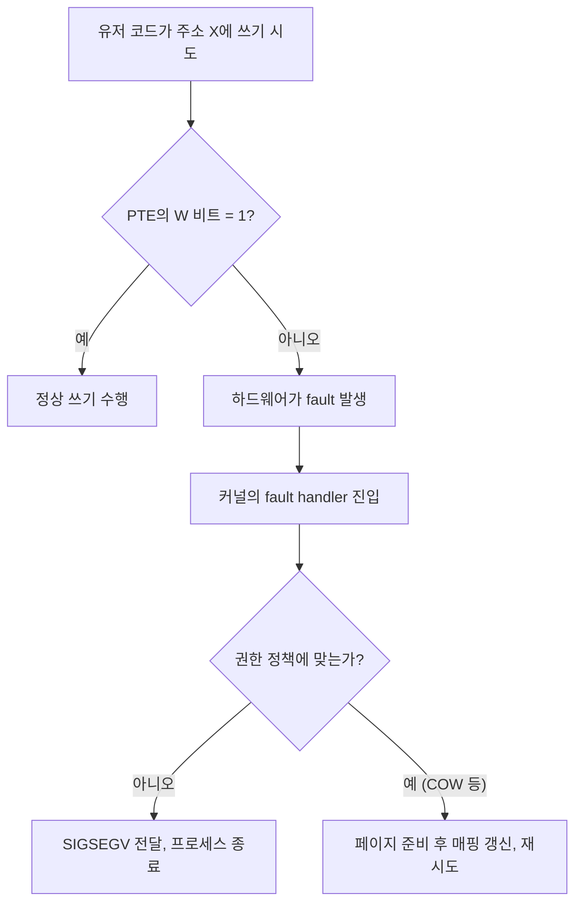

# 가상 메모리가 푸는 세 가지 문제

프로그램은 메모리 주소 `0x7ffe12340000`에 정수를 쓰고, 다시 그 주소에서 같은 값을 읽습니다.
이 주소는 물리 DRAM의 실제 위치가 아닙니다.
CPU가 명령어에 담아 보내는 주소는 가상 주소(Virtual Address) 이고, DRAM 셀에 도달하는 주소는 물리 주소(Physical Address) 입니다.
두 주소 사이에는 운영체제와 하드웨어가 협력해 유지하는 번역(translation) 기계가 있습니다.
그 기계 전체를 가상 메모리(Virtual Memory) 라 부릅니다.

가상 메모리는 하나의 기능이 아니라 세 가지 문제를 한꺼번에 푸는 설계입니다.

## 문제 1 — DRAM을 디스크의 캐시로 쓴다 (Caching)

프로그램이 요구하는 총 메모리는 종종 물리 DRAM보다 큽니다.
수백 개의 프로세스가 동시에 돌고 있는 서버에서, 각 프로세스가 "내게는 수십 GB가 있다"고 믿게 만들려면 물리적으로 부족한 DRAM을 어떻게든 늘려야 합니다.
가상 메모리는 디스크를 메모리의 연장으로 편입시켜 이 문제를 풉니다.

이 관점에서 DRAM은 디스크의 캐시입니다.
자주 쓰이는 페이지만 DRAM에 두고, 쓰이지 않는 페이지는 디스크로 밀어냅니다.
프로그램은 여전히 자기 가상 주소에 값이 있다고 믿지만, 실제로는 DRAM에 없을 수도 있습니다.
없을 때 CPU가 일으키는 예외가 `page fault` 이고, 커널이 디스크에서 해당 페이지를 DRAM으로 끌어 올린 뒤 명령어가 재실행됩니다.

캐싱 관점이 없다면 가상 주소 공간의 크기는 DRAM 용량에 묶여 있어야 합니다.
가상 메모리는 이 제약을 끊습니다.

## 문제 2 — 프로세스마다 독립된 주소 공간을 준다 (Memory Management)

여러 프로세스가 같은 DRAM을 공유하면서도 서로의 데이터를 건드리지 않으려면, 각 프로세스가 자기만의 주소 공간을 가져야 합니다.
물리 DRAM에는 한 번만 존재하지만, 프로세스 A의 `0x400000`과 프로세스 B의 `0x400000`은 서로 다른 물리 주소를 가리킵니다.
이 일대일 착각을 만들어 주는 것이 가상 메모리입니다.

두 프로세스의 `0x400000`은 같은 가상 주소이지만 각기 다른 페이지 테이블을 거쳐 서로 다른 프레임으로 매핑됩니다.
같은 주소가 다른 의미를 갖는 이 분리가 있기에:

- 프로세스가 충돌 없이 공존합니다.
- 링커와 로더는 언제나 같은 기준 주소에서 시작한다고 가정할 수 있습니다. 재배치(relocation) 부담이 줄어듭니다.
- 힙을 늘릴 때 다른 프로세스의 영역과 부딪힐까 걱정하지 않아도 됩니다. 물리 프레임은 흩어져 있어도 가상에서는 연속처럼 보이기 때문입니다.

또한 커널은 같은 물리 페이지를 두 프로세스의 서로 다른 가상 주소에 매핑할 수도 있습니다.
공유 라이브러리(libc 같은), 공유 메모리 IPC, fork 직후의 COW 페이지가 이 기법의 예입니다.
관리 자유도가 크게 올라갑니다.

## 문제 3 — 프로세스가 건드려서는 안 될 메모리를 막는다 (Protection)

프로세스는 자기 주소 공간 안에서도 아무 페이지나 아무렇게 다룰 수 없어야 합니다.
코드 영역은 실행만 가능해야 하고 수정되면 안 됩니다.
읽기 전용 문자열은 쓰기가 막혀야 합니다.
다른 프로세스의 메모리에는 접근할 수 없어야 합니다.
무엇보다 커널의 주소 공간은 사용자 모드에서 읽을 수도, 쓸 수도, 실행할 수도 없어야 합니다.

이 모든 보호 규칙은 페이지 테이블 엔트리(PTE)의 권한 비트에 기록되어 있습니다.

| 비트 | 이름 | 의미 |
|------|------|------|
| P | Present | 매핑이 유효한가 |
| W | Writable | 쓰기 허용 |
| U | User/Supervisor | 유저 모드에서 접근 가능한가 |
| A | Accessed | 최근 접근 여부 |
| D | Dirty | 수정 여부 |
| NX | No-Execute | 실행 금지 |

CPU가 메모리에 접근할 때 MMU는 주소 번역과 함께 권한 비트도 검사합니다.
쓰기 불가능한 페이지에 쓰려 하거나, 유저 모드에서 커널 페이지에 접근하려 하면 하드웨어가 일반 보호 예외(General Protection Fault) 혹은 `page fault`를 발생시킵니다.
커널이 그 프로세스를 `SIGSEGV`로 종료시킵니다.

보호는 프로세스 단위만의 일이 아닙니다.
한 프로세스 내에서도 스택은 실행 불가(NX), 코드는 쓰기 불가, 읽기 전용 데이터는 쓰기 불가와 같이 영역별로 서로 다른 권한이 걸립니다.
이것이 스택 기반 공격이나 코드 인젝션의 1차 방어선이 됩니다.

## 세 역할을 잇는 공통 장치: 페이지 테이블

세 문제를 한꺼번에 풀어내는 공통 장치는 주소 번역 테이블(페이지 테이블) 입니다.

- 캐싱 관점: PTE에 "이 페이지가 지금 DRAM에 있는가"를 기록합니다. (`P` 비트).
- 관리 관점: 프로세스마다 별개의 페이지 테이블을 둬 같은 가상 주소가 다른 물리 주소로 매핑되게 합니다.
- 보호 관점: PTE에 권한 비트를 박아 하드웨어가 번역과 동시에 검사하게 합니다.

하나의 자료구조가 세 역할을 동시에 수행하므로, 번역 비용 한 번에 세 문제 모두의 답이 나옵니다. 이 우아함이 가상 메모리가 오늘날 컴퓨팅의 표준이 된 이유입니다.

## 정리

가상 메모리는 "물리 주소를 숨긴다"는 기능이 아니라, 캐싱, 관리, 보호라는 서로 다른 세 문제를 페이지 테이블이라는 하나의 자료구조로 동시에 해결하는 설계 철학입니다.
프로그램이 쓰는 모든 주소는 이 세 관점을 통과한 뒤에야 비로소 DRAM 셀에 도달합니다.
그래서 가상 메모리를 이해한다는 것은, 이 세 역할이 하나의 번역 테이블에 어떻게 중첩되는지를 이해한다는 것입니다.
