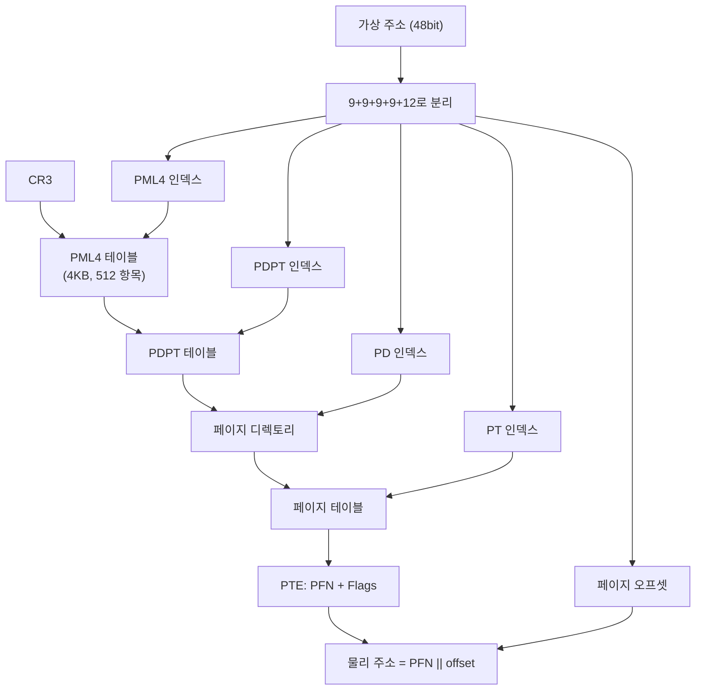
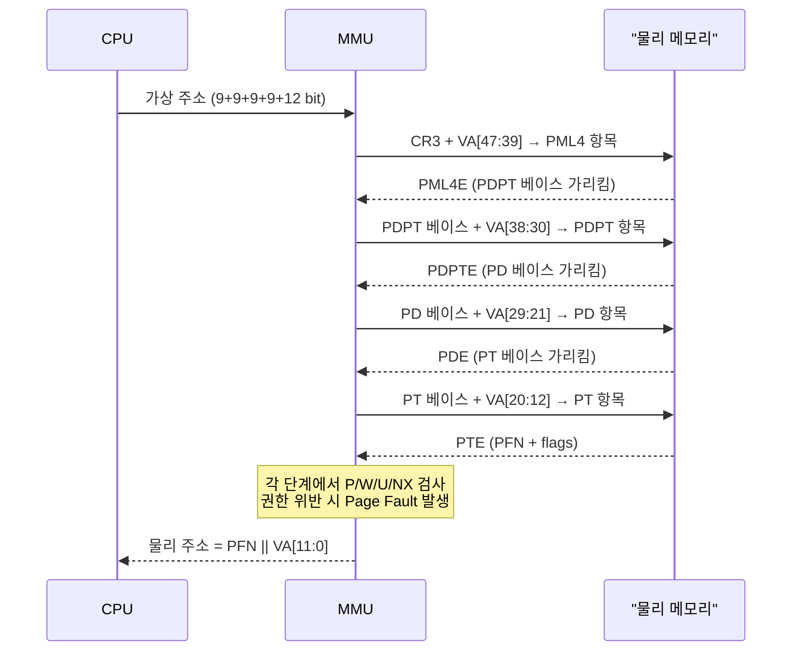

# 다단계 페이지 테이블과 MMU

48비트 가상 주소 공간을 4 KB 페이지로 나누면 엔트리 약 640억 개짜리 단일 테이블이 나옵니다.
한 PTE가 8바이트라면 그 테이블 하나에 약 512 GB가 필요합니다.
아무리 적은 프로세스를 가정해도 현실적이지 않습니다.
그래서 실제 시스템은 페이지 테이블 자체를 여러 단계(multi-level) 로 자릅니다.
이 다단계 테이블을 자동으로 걸어 번역을 수행하는 하드웨어가 MMU(Memory Management Unit) 입니다.

## 왜 다단계인가 — 단일 테이블의 문제

단일 페이지 테이블이라면 프로세스마다 512 GB 수준의 공간을 미리 잡아 두어야 합니다.
대부분의 가상 주소 공간은 비어 있다는 사실을 활용하지 못합니다.
스택 근처와 힙 근처에 몇 MB씩만 쓰고 나머지는 사용되지 않는 것이 현실인데, 단일 테이블은 사용되지 않는 구간에도 엔트리 자리를 잡습니다.

다단계 테이블은 이 빈 공간을 자연스럽게 생략합니다.
상위 테이블의 한 엔트리가 "비어 있음"을 가리키면 그 아래의 하위 테이블은 아예 존재하지 않습니다.
필요한 부분만 트리 형태로 만들어지므로, 실제 사용 중인 페이지 수에 비례하는 메모리만 듭니다.

## x86-64의 4단계 트리

x86-64(48비트 모드)는 4단계 페이지 테이블을 씁니다. 가상 주소의 상위 48비트는 9+9+9+9+12로 쪼개지고, 각 9비트가 한 단계의 테이블 인덱스가 됩니다.

```
 48비트 가상 주소
┌───────┬───────┬───────┬───────┬─────────────┐
│  PML4 │  PDPT │  PD   │  PT   │  Page Offset │
│ 9bit  │ 9bit  │ 9bit  │ 9bit  │   12bit       │
└───────┴───────┴───────┴───────┴─────────────┘
```

각 레벨의 테이블은 4 KB 한 페이지로 구성되며, 512개의 8바이트 엔트리를 담습니다. 그래서 각 단계의 인덱스가 9비트(2^9 = 512)입니다. 번역은 CPU의 CR3 레지스터에 담긴 PML4 테이블의 물리 주소에서 시작합니다.



번역 한 번에 네 번의 메모리 읽기가 필요합니다.
이 비용이 곧 `TLB`의 존재 이유가 됩니다.
한 번 번역한 결과를 캐시해 다음 접근에서 재사용합니다.

## MMU가 하는 일

MMU는 CPU 칩 안에 있는 전용 회로입니다.
매 메모리 접근마다 다음을 수행합니다.

1. CPU가 제공한 가상 주소를 받아 9+9+9+9+12로 분리합니다.
2. CR3 → PML4 → PDPT → PD → PT 를 순서대로 읽어 최종 PTE를 얻습니다.
   이 과정을 페이지 워크(Page Walk) 라 부릅니다.
3. 각 레벨에서 엔트리의 Present(P) 비트가 1이고, 요구한 접근 종류가 해당 엔트리의 권한(W, U, NX)에 맞는지 확인합니다.
4. 어느 레벨에서든 조건이 어긋나면 CPU에 `page fault` 또는 일반 보호 예외를 던집니다.
5. 조건이 모두 맞으면 최종 PFN과 12비트 오프셋을 이어 붙여 물리 주소를 만들어 메모리 버스에 탑니다.



이 작업은 CPU 명령어를 실행하는 파이프라인의 아주 아랫부분에서, 소프트웨어의 개입 없이 일어납니다.
커널은 테이블의 내용을 채워 넣을 뿐이고, 걸어 내려가는 일은 전적으로 하드웨어의 몫입니다.

## CR3 — 프로세스를 식별하는 포인터

프로세스마다 고유한 페이지 테이블 트리를 가지며, 그 트리의 최상단 PML4 주소가 `CR3` 레지스터에 담깁니다.
커널은 컨텍스트 스위치 때 CR3 값을 새 프로세스의 PML4 물리 주소로 바꿔줍니다.
이 한 번의 레지스터 쓰기로 CPU가 보는 주소 공간 전체가 교체됩니다.

CR3가 바뀌면 하드웨어는 기존 번역 캐시(`TLB`)를 무효화해야 합니다.
프로세스마다 주소 공간이 다르기 때문입니다.
이 무효화 비용 때문에 컨텍스트 스위치는 단순한 레지스터 저장·복원보다 훨씬 비쌉니다.

## huge page — 계층 일부를 생략한다

4단계 번역은 4 KB 페이지를 기본 가정으로 합니다. 그러나 x86-64는 중간 단계에서 번역을 멈추는 옵션도 제공합니다.

- 2 MB page: PD 레벨의 엔트리가 하위 PT를 가리키는 대신 바로 2 MB 프레임을 가리킵니다.
  번역은 PML4 → PDPT → PD에서 끝납니다.
- 1 GB page: PDPT 레벨의 엔트리가 1 GB 프레임을 직접 가리킵니다.
  번역은 PML4 → PDPT에서 끝납니다.

큰 페이지는 두 가지 이득을 줍니다.
첫째, 페이지 워크의 단계가 줄어 번역 자체가 빨라집니다.
둘째, `TLB` 한 엔트리가 더 큰 영역을 커버해 TLB miss가 줄어듭니다.
단점은 내부 단편화와 큰 연속 물리 프레임을 확보해야 하는 어려움입니다.
DBMS, HPC, JVM 같은 거대한 힙을 쓰는 응용에서 선택적으로 쓰입니다.

## 커널이 기여하는 부분

하드웨어가 번역을 수행한다고 해도, 테이블의 내용물을 채우는 일은 언제나 커널의 책임입니다.
프로세스가 생성될 때 커널은 PML4를 만들고, 필요한 구간에 대해서만 하위 테이블을 확장합니다.
주소 공간이 변화할 때 — mmap, munmap, brk, exec, fork — 커널은 PTE를 수정해 가상↔물리 대응을 갱신합니다.
하드웨어와 소프트웨어의 역할 분담은 명확합니다.

- 하드웨어(MMU): 매 접근마다 테이블을 걸어 내려가 번역하고 권한을 검사합니다.
- 소프트웨어(커널): 테이블을 언제 어떻게 채울지 결정합니다.

## 정리

다단계 페이지 테이블은 "비어 있는 주소 공간은 테이블도 없다"는 원칙으로 거대한 가상 공간을 현실적인 메모리 비용으로 관리합니다.
MMU는 그 트리를 하드웨어 수준에서 자동으로 걸어 내려가며 번역과 보호 검사를 동시에 수행합니다.
CR3 레지스터 하나를 바꾸면 프로세스 전체의 주소 공간이 바뀝니다.
이 분업 — "구조는 소프트웨어가, 탐색은 하드웨어가" — 가 현대 OS의 가상 메모리 구현을 떠받치는 근본 구조입니다.
