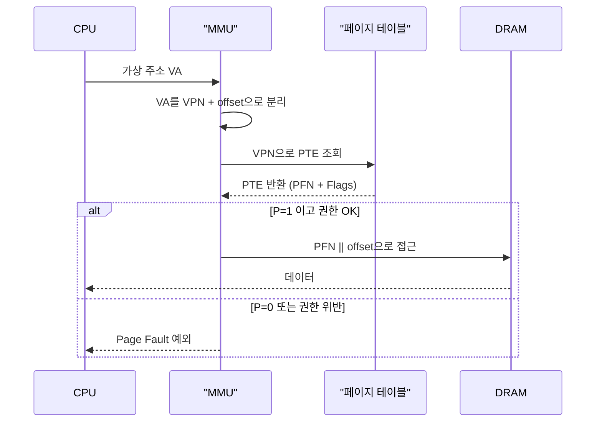

# 페이지 테이블 — 가상과 물리를 잇는 지도

모든 메모리 접근은 가상 주소(Virtual Address) 에서 시작해 물리 주소(Physical Address) 로 끝납니다.
이 두 주소를 잇는 자료구조가 페이지 테이블(Page Table) 이고, 그 각 원소가 페이지 테이블 엔트리(PTE, Page Table Entry) 입니다.
페이지 테이블은 프로세스마다 하나씩 존재하며, CPU가 명령어를 실행할 때 하드웨어가 자동으로 이 테이블을 읽어 주소를 번역합니다.

## 왜 바이트 단위가 아니라 페이지 단위인가

가상 주소와 물리 주소를 연결하는 일대일 테이블을 만든다고 상상해 봅시다.
48비트 가상 주소 공간은 256 TB입니다.
한 바이트마다 매핑 엔트리를 두면 엔트리만으로 주소 공간을 넘어섭니다.
비현실적입니다.

그래서 주소 공간을 페이지(Page) 라는 고정 크기 블록으로 자릅니다.
대부분의 시스템에서 페이지 크기는 4 KB입니다.
페이지 단위로 매핑하면 48비트 공간에 대해 약 640억 개의 엔트리로 충분합니다.
또, 같은 크기의 물리 메모리 조각을 페이지 프레임(Page Frame) 이라 부릅니다.
페이지와 프레임은 모두 4 KB로 같은 크기이기에, 번역은 "가상 페이지 번호 → 물리 프레임 번호" 하나만 다루면 됩니다.
페이지 안에서의 오프셋(하위 12비트)은 번역 없이 그대로 전달됩니다.

```
   48비트 가상 주소
┌──────────────────────────────────────┬──────────────────┐
│       가상 페이지 번호 (VPN)           │     오프셋        │
│            상위 36비트                 │    하위 12비트    │
└──────────────────────────────────────┴──────────────────┘
                    │                           │
                    ▼                           │
         페이지 테이블에서 번역                    │
                    ▼                           ▼
┌──────────────────────────────────────┬──────────────────┐
│       물리 프레임 번호 (PFN)           │     오프셋        │
└──────────────────────────────────────┴──────────────────┘
   물리 주소 (번역 결과)
```

페이지 단위의 번역은 엔트리 수를 줄이는 동시에, 보호 비트·dirty 비트 등 페이지 수준의 속성을 자연스럽게 싣는 자리를 만듭니다.

## PTE의 구조

PTE는 64비트짜리 한 칸입니다. 하드웨어는 이 한 칸 안에 물리 프레임 번호와 여러 속성 비트를 함께 담습니다. x86-64 기준 개념 모델은 다음과 같습니다.

```
   63                              12 11               0
   ┌────────────────────────────────┬──────────────────┐
   │       Physical Frame #         │  Flags (12 bit)  │
   └────────────────────────────────┴──────────────────┘
```

| 비트 | 이름 | 의미 |
|------|------|------|
| P | Present | 물리 프레임 매핑 존재 |
| W | Writable | 쓰기 허용 |
| U | User/Supervisor | 유저 모드 접근 |
| A | Accessed | 접근된 적 있음 |
| D | Dirty | 수정된 적 있음 |
| NX | No-Execute | 실행 금지 |

각 비트의 의미는 단순하지만 전체 시스템의 동작을 결정합니다.

- P (Present): 이 페이지가 지금 DRAM에 있는가.
  0이면 `page fault`가 납니다.
  디스크에 스왑아웃된 페이지, 아직 할당되지 않은 페이지, 매핑만 예약된 페이지 모두 P=0입니다.
- W (Writable): 쓰기 허용 여부. 0인데 쓰면 하드웨어가 fault를 발생시킵니다. 코드 영역이나 COW 페이지가 이 비트를 0으로 둡니다.
- U (User/Supervisor): 유저 모드에서 접근 가능한가. 커널 주소 공간의 PTE들은 모두 U=0입니다.
- A (Accessed): CPU가 이 페이지를 한 번이라도 접근하면 1로 섭니다. 페이지 교체 알고리즘이 LRU 근사를 위해 참고합니다.
- D (Dirty): 이 페이지를 쓰기로 수정한 적이 있는가. 스왑아웃 시 "변경 없으면 다시 쓸 필요 없음"을 판단합니다.
- NX (No-Execute): 이 페이지의 바이트를 명령어로 실행하는 것을 막습니다. 스택·힙에서 코드 실행 공격을 차단하는 기본 방어선입니다.

## 번역의 기본 흐름

한 번의 메모리 접근이 페이지 테이블을 만나는 순간은 이렇습니다.



정상 경로에서 MMU는 가상 페이지 번호(VPN) 를 인덱스로 PTE를 꺼내고, PTE의 Present·권한 비트를 확인한 뒤, 물리 프레임 번호(PFN)와 원래 오프셋을 결합해 최종 물리 주소를 만듭니다.
페이지 테이블을 한 번 거치는 것만으로 번역과 보호 검사가 동시에 끝납니다.

문제 경로에서 MMU는 번역을 중단하고 CPU에 예외를 던집니다. 커널의 페이지 폴트 핸들러가 원인(P=0인지, 권한 위반인지, 존재하지 않는 주소인지)을 판단해 적절한 조치를 합니다.

## PTE 한 칸으로 가능한 것들

이 작은 구조가 OS의 많은 기능을 가능하게 합니다.

- 지연 할당: 커널이 PTE를 P=0 상태로만 만들어 두고 실제 프레임은 최초 접근 시점에 채웁니다.
  필요 없는 페이지에 프레임을 소모하지 않습니다.
- 공유: 두 프로세스의 PTE가 같은 PFN을 가리키게 하면 물리 프레임 하나를 공유합니다.
  공유 라이브러리, 공유 메모리가 이 원리입니다.
- Copy-on-Write: 공유 중인 두 PTE를 W=0으로 만들어 쓰기 시도만 fault로 잡아냅니다.
  쓴 쪽에만 새 프레임을 배정합니다.
- 스왑: 필요 없어진 페이지의 PTE를 P=0으로 바꾸고 프레임을 디스크로 밀어냅니다.
  재접근 시 fault가 들어오면 디스크에서 복원합니다.
- 메모리 매핑 I/O: 파일의 일부를 가상 주소 공간에 매핑합니다.
  읽기는 fault를 통한 디스크 I/O로, 쓰기는 D 비트를 통한 동기화로 구현됩니다.

즉 PTE의 속성 비트는 단순한 플래그가 아니라, 운영체제가 메모리와 디스크를 엮는 제어 채널입니다.

## 정리

페이지 테이블은 가상 주소 공간과 물리 메모리를 잇는 유일한 자료구조이고, PTE는 그 테이블의 한 칸입니다.
4 KB 단위로 자른 가상 주소 공간은 엔트리 수를 감당 가능한 규모로 줄이며, 한 PTE 안에 담긴 속성 비트들은 번역·보호·지연·공유·스왑을 동시에 표현합니다.
운영체제가 메모리에 대해 하는 거의 모든 일은 결국 PTE를 특정 상태로 세우는 일로 수렴합니다.
