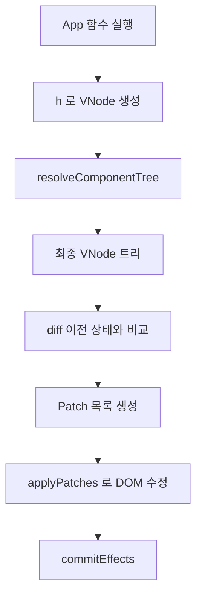

# VDOM, Resolver, Diff, Patch

## VDOM 이 필요한 이유

화면을 바로 DOM 으로 만들면 비교와 업데이트가 어렵습니다. 먼저 "화면 설명서" 를 만들고, 이후 DOM 반영을 그 설명서와 맞춥니다. 이 설명서가 `VNode` 입니다.

예를 들어 다음 호출은

```js
h("button", { onClick: handleClick }, "Save")
```

대략 다음 구조의 VNode 로 바뀝니다.

```js
{
  type: "element",
  tag: "button",
  props: {},
  events: { click: handleClick },
  children: [{ type: "text", text: "Save" }],
}
```

즉 VNode 는 "지금 화면이 어떻게 생겨야 하는가" 를 객체로 표현한 중간 표현입니다.

## h() 가 하는 일

`h()` 의 책임은 다음과 같습니다.

- `key` 분리
- 이벤트 prop 분리
- 일반 props 정리
- children 평탄화
- 최종 element VNode 생성

### 이벤트를 따로 분리하는 이유

`onClick` 은 일반 DOM 속성이 아닙니다. 실제 DOM 에서는 `addEventListener("click", handler)` 로 연결해야 합니다. `h()` 는 `onClick` 같은 값을 `events` 맵에 따로 저장해 이후 patch 단계에서 실제 DOM 이벤트로 반영하도록 합니다.

다만 자식 stateless component 에 함수 prop 을 넘기는 경우도 있으므로, `tag` 가 함수가 아닌 실제 DOM 태그일 때만 DOM 이벤트로 분리합니다.

## 자식 컴포넌트가 바로 DOM 이 될 수 없는 이유

아래 선언을 보면 됩니다.

```js
h(CardTile, { card, onSelect })
```

브라우저는 `CardTile` 이라는 함수를 직접 이해하지 못합니다. 먼저 이 함수를 실행해 반환된 VNode 트리로 펼쳐야 합니다. 이 작업이 resolver 의 역할입니다.

## resolveComponentTree()

resolver 는 다음 규칙으로 트리를 정리합니다.

1. 입력 VNode 가 text 면 그대로 반환
2. 일반 DOM 태그면 자식만 재귀적으로 전개
3. 함수형 자식 컴포넌트면 직접 호출
4. 반환값을 다시 VNode 로 정규화
5. 최종적으로 함수 태그가 없는 VNode 트리만 남김

```mermaid
flowchart TD
  A[h(CardTile, props)] --> B[resolveComponentTree]
  B --> C[CardTile(props) 실행]
  C --> D[h(article, ...)]
  D --> E[일반 VNode 트리]
```

## Diff 가 계산하는 것

Diff 는 이전 VNode 와 다음 VNode 를 비교해 다음 질문에 답합니다.

- 텍스트가 바뀌었는가
- 태그가 바뀌었는가
- props 가 바뀌었는가
- 이벤트가 바뀌었는가
- 자식이 추가·삭제·이동했는가

결과는 `Patch[]` 입니다. 대표 patch 종류는 다음과 같습니다.

- `SET_TEXT`
- `SET_PROP`, `REMOVE_PROP`
- `INSERT_CHILD`, `REMOVE_CHILD`, `MOVE_CHILD`
- `REPLACE_NODE`
- `SET_EVENT`, `REMOVE_EVENT`

## key 의 역할

리스트 렌더링에서 `key` 는 "이 아이템이 누구인가" 를 알려주는 식별자입니다. 카드 컬렉션에서 정렬 순서가 바뀌어도 같은 카드면 key 는 같아야 합니다. 그래야 diff 가 "새로 생긴 카드" 가 아니라 "기존 카드가 이동한 것" 으로 판단해 DOM 재사용을 극대화합니다.

## Patch 가 실제 DOM 을 바꾸는 방식

Patch 계층은 diff 결과를 실제 DOM 조작으로 변환합니다. 예시는 다음과 같습니다.

- `SET_TEXT` → `textContent` 변경
- `SET_PROP` → DOM 속성 반영
- `SET_EVENT` → `addEventListener`
- `INSERT_CHILD` → `insertBefore`
- `REMOVE_CHILD` → `removeChild`

diff 가 "무엇을 바꿔야 하는가" 를 계산하면, patch 는 "실제로 어떻게 바꿀 것인가" 를 수행합니다.

## DOM 생성 시점

초기 mount 에서는 `createDom.js` 가 전체 VNode 트리를 DOM 으로 바꿉니다. update 에서는 전체를 다시 만들지 않고 patch 만 반영합니다.

## 이벤트 바인딩

`applyEvents.js` 는 이벤트를 다음 방식으로 관리합니다.

- 이전 핸들러가 있으면 제거
- 새 핸들러가 있으면 등록
- 사라진 이벤트는 제거

렌더가 다시 일어나도 이전 핸들러가 중복으로 남지 않도록 유지합니다.

## props 반영

`applyProps.js` 는 일반 속성과 form control 특수 속성을 다르게 다룹니다. 예를 들어 `className`, `value`, `checked`, `selected` 같은 속성은 단순 문자열 attribute 와 동작이 달라 전용 처리가 필요합니다.

## 엔진 계층

`createEngine.js` 는 runtime 과 diff/patch 계층을 잇는 중간 facade 입니다. 엔진이 관리하는 상태는 다음과 같습니다.

- 현재 VNode
- diff mode
- history
- 마지막 patch 목록
- root DOM 동기화

런타임은 Hook 과 상태를 관리하고, 엔진은 VDOM 과 DOM 반영을 관리합니다.

## 전체 데이터 흐름



## 요약

한 문장으로 정리하면 다음과 같습니다.

> 이 런타임은 화면을 먼저 VNode 로 설명하고, resolver 로 자식 컴포넌트를 펼친 뒤, diff 로 바뀐 점만 계산하고, patch 로 DOM 에 최소 수정만 적용합니다.

## 다음으로 볼 키워드

- VNode 구조와 ElementVNode · TextVNode 타입
- Fiber 아키텍처와 이 런타임 모델의 차이
- update 흐름과 batching 스케줄링
