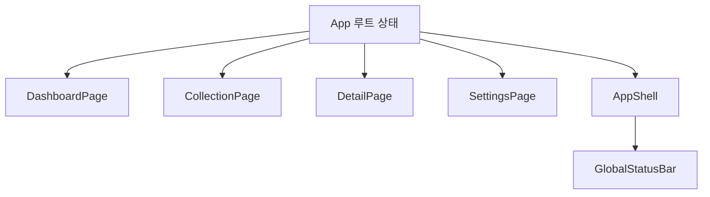

# 카드 컬렉션 쇼케이스 앱 구성

## 앱의 목적

이 앱은 자체 제작한 React-like 런타임이 실제 화면 변화를 어떻게 처리하는지 보여주는 시연용 SPA 입니다. 두 가지 목적을 동시에 만족하도록 설계되어 있습니다.

- 시각적으로 즉시 흥미를 끄는 카드 UI 제공
- 라이브러리의 상태 관리·렌더링·페이지 전환을 명확히 노출

## 전체 구조

주요 파일은 다음과 같습니다.

- `src/app/App.js`, `src/app/main.js`
- `src/app/data/pokeApiClient.js`, `cardLibrary.js`
- `src/app/components/*`, `src/app/pages/*`

앱은 네 페이지로 구성됩니다.

- `dashboard`
- `collection`
- `detail`
- `settings`

HTML 엔트리는 하나뿐입니다. 하나의 루트 앱 안에서 `currentPage` 상태만 바꿔 여러 페이지처럼 보이게 만듭니다.

## 루트 상태

모든 핵심 상태는 `src/app/App.js` 에 모여 있습니다. 대표 상태는 다음과 같습니다.

- `currentPage`, `cards`, `isLoading`, `loadError`
- `selectedCardId`, `searchKeyword`, `typeFilter`, `favoritesOnly`, `sortMode`
- `lastAction`, `settings`

이 구조가 중요한 이유는 상위 런타임이 "루트만 상태를 가진다" 는 규칙을 강제하기 때문입니다. 자식은 Hook 을 사용하지 않고 `props` 로만 렌더합니다.

## 데이터 흐름

하나의 루트 상태가 여러 페이지와 공통 셸에 동시에 전달됩니다. 예를 들어 `lastAction` 이 바뀌면 상단 상태 배너, 대시보드의 최근 액션, 상세 페이지 이동 흐름이 함께 영향을 받습니다.

## 페이지별 역할

### 대시보드 (`DashboardPage`)

- 전체 카드 수, 즐겨찾기 수, 현재 보이는 카드 수, 선택된 카드, Spotlight, 타입 요약 표시
- "지금 상태가 어떤가" 를 보여주는 요약 페이지

### 컬렉션 (`CollectionPage`)

- 검색, 타입 필터, 즐겨찾기 필터, 정렬, 카드 선택, 즐겨찾기 토글
- 실제 상호작용의 중심 페이지

현재 구현은 성능을 위해 컬렉션을 가상 스크롤 방식으로 렌더합니다.

- 전체 1025 장을 한 번에 DOM 에 올리지 않음
- 현재 화면 근처 카드만 렌더
- 스크롤 높이는 전체 목록이 있는 것처럼 유지
- 데스크톱에서는 카드가 최소 3 열 이상 보이도록 본문 폭을 우선 배분

### 상세 (`DetailPage`)

- 선택된 카드 크게 표시
- 메인 카드 아래에 `Game Sprite` 비교 카드 표시
- 타입, 번호, 높이, 무게, 설명, 종족값 6 종과 Base Stat Total 노출
- 즐겨찾기 토글, 관련 카드 이동, 다음 카드 이동

### 설정 (`SettingsPage`)

- 기본 시작 페이지, 기본 정렬, tilt on/off, glare on/off, 고해상도 이미지 on/off, 데모 리셋
- 전역 표현 정책을 바꾸는 페이지

## 외부 이미지와 데이터

- 원격 데이터: `PokeAPI`
- 이미지: `official-artwork` 와 기본 sprite
- 정규 전국도감 범위: `#001 ~ #1025`
- 원격 실패 시 `cardLibrary` fallback 사용
- 초기 로드는 shell 카드를 고정 순서로 만들고, 이후 현재 화면 근처 구간만 점진적으로 hydrate

카드 하나가 가진 대표 필드는 `id`, `name`, `number`, `imageUrl`, `thumbUrl`, `types`, `rarity`, `height`, `weight`, `baseStats`, `flavor`, `isFavorite` 입니다.

## 3D 틸트를 상태로 다루지 않은 이유

카드 틸트는 마우스가 움직일 때마다 계속 값이 바뀝니다. 이를 루트 `useState` 에 올리면 전체 렌더가 초고빈도로 일어납니다. 한편 역할을 다음과 같이 분리했습니다.

- 상태 기반 렌더러가 담당: 카드 선택, 페이지 전환, 정렬, 필터, 즐겨찾기, 설정
- 카드 DOM 보조 효과가 담당: tilt 각도, glare 위치, 마우스 이탈 시 원위치 복귀

"데이터 변화" 와 "초고빈도 시각 효과" 를 서로 다른 경로로 처리하는 설계입니다.

## 틸트 동작 방식

`src/app/App.js` 의 `handlePointerMove()` 와 `handlePointerLeave()` 가 이 역할을 맡습니다. 흐름은 다음과 같습니다.

1. 마우스가 카드 위에서 움직임
2. 카드 DOM 의 bounding box 를 읽음
3. 카드 안에서의 상대 좌표 계산
4. 좌표를 `rotateX`, `rotateY` 로 변환
5. glare 위치도 함께 계산
6. 해당 카드 element 의 inline style 을 직접 갱신

이 효과는 전역 렌더가 아니라 해당 카드 DOM 하나만 수정하는 보조 효과입니다.

## localStorage 활용

현재 앱은 즐겨찾기와 설정 상태를 localStorage 에 저장합니다. 저장 시점은 루트 상태가 바뀐 뒤 `useEffect` 안에서 처리합니다. `useEffect` 가 실제 외부 시스템과 상호작용하는 전형적인 예시입니다.

## 다국어·타입 배지·가상 스크롤 메모

현재 구현에는 초기 기획보다 확장된 동작이 포함되어 있습니다.

- 타입 필터 사용 시 전체 타입 데이터를 먼저 로드한 뒤 결과를 표시
- UI locale 과 포켓몬 이름 locale 을 함께 운용 (English, 한국어, 日本語, 中文, Español)
- 포켓몬 이름은 로컬 이름 사전을 우선 사용하고, 없는 항목만 `pokemon-species` 로 fallback
- 컬렉션 타입 배지는 18 개 타입 전체에 공식 팔레트 톤을 사용
- 가상 스크롤은 함수형 자식 key 보존과 patch 순서 보정으로 카드 재사용 시 타입 배지가 섞이지 않도록 안정화
- 스크롤 컨테이너는 유지하고 내부 window 만 교체해 스크롤 위치를 보존
- Detail 페이지 연관 포켓몬은 같은 진화트리를 먼저 표시하고 부족한 칸은 같은 타입·유사 종족값으로 채움
- Render / Patch Inspector 는 데스크톱에서만 노출하고 모바일에서는 숨김

## 테스트 대상

앱 테스트 (`src/tests/app.test.js`) 가 검증하는 항목은 다음과 같습니다.

- 대시보드 첫 렌더
- 컬렉션 검색과 선택
- 즐겨찾기 반영
- 설정 반영
- 원격 카탈로그 fallback 안내
- Inspector 가 `img src` patch 를 보여주는지
- 컬렉션이 대량 카탈로그에서도 현재 구간만 렌더하는지

기준은 "화면이 예쁜가" 가 아니라 "상태 변화가 앱 전반에 올바르게 전파되는가" 입니다.

## 다음으로 볼 키워드

- 상태 기반 페이지 전환 설계 (라우터 없는 SPA 패턴)
- 고빈도 시각 효과를 상태와 분리하는 보조 DOM effect 설계
- 가상 스크롤과 함수형 컴포넌트 key 보존의 관계
