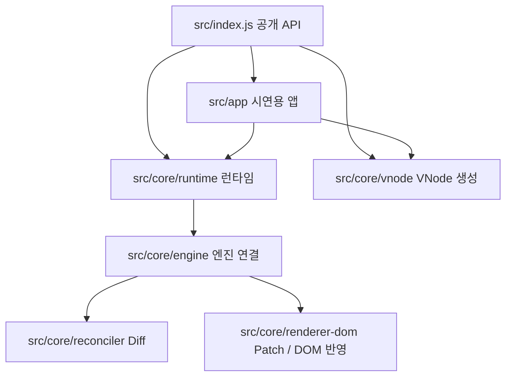
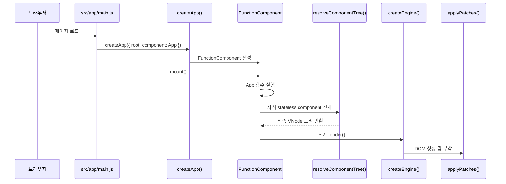

# React-like 런타임 개요

## 이 프로젝트가 다루는 범위

이 저장소는 "React 를 사용하는 앱" 이 아니라 "React 와 비슷한 런타임을 직접 만들고 그 위에 앱을 올린 저장소" 입니다. 구조는 크게 두 부분으로 나뉩니다.

- 라이브러리 본체: Virtual DOM, Diff/Patch, 루트 컴포넌트 런타임, `useState`·`useEffect`·`useMemo`
- 시연용 앱: 카드 컬렉션 쇼케이스. 라이브러리의 공개 API 만 사용합니다.

라이브러리는 "상태가 바뀌면 언제 다시 렌더할지" 와 "무엇을 실제 DOM 에 반영할지" 를 분리해 다룹니다. 앱은 그 위에서 루트 상태만 소유하고 자식 컴포넌트는 `props` 로 전달받은 값으로 렌더합니다.

## 큰 구조

핵심 포인트는 다음과 같습니다.

- `src/index.js` 는 라이브러리의 정문입니다. 앱은 항상 이 파일만 import 합니다.
- `src/core/runtime` 은 상태와 Hook 을 관리합니다.
- `src/core/vnode` 는 화면 설명서를 만듭니다.
- `src/core/reconciler` 는 "무엇이 바뀌었는가" 를 계산합니다.
- `src/core/renderer-dom` 은 실제 DOM 을 고칩니다.

## 계층별 역할

### 공개 API

`src/index.js` 는 외부에서 사용할 API 만 모아 export 합니다. 노출 대상은 다음과 같습니다.

- `createApp`
- `FunctionComponent`
- `h`
- `useState`, `useEffect`, `useMemo`

앱은 `src/core/...` 내부 구현을 직접 참조하지 않고 항상 이 공개 엔트리포인트를 통해 사용합니다.

### 런타임

- `FunctionComponent.js`: 루트 함수형 컴포넌트를 감싸는 관리자 클래스
- `createApp.js`: 공개 래퍼
- `scheduleUpdate.js`: 재렌더 예약
- `commitEffects.js`: DOM 반영 후 effect 실행
- `unmountComponent.js`: 종료 정리

"상태가 바뀌면 언제 다시 렌더할지" 를 결정하는 계층입니다.

### Hook

- `hooks/useState.js`
- `hooks/useEffect.js`
- `hooks/useMemo.js`

Hook 호출 순서를 기억하고 각 Hook 이 자신의 슬롯을 유지하도록 만듭니다. 슬롯은 이름이 아니라 인덱스로 구분합니다.

### VNode

- `vnode/h.js`
- `vnode/normalizeChildren.js`

실제 DOM 을 바로 만들지 않고 "화면 설명서" 에 해당하는 VNode 를 먼저 만듭니다.

### Resolver

- `runtime/resolveComponentTree.js`

`h(CardTile, props)` 같은 자식 함수형 컴포넌트 선언을 실제 `div`·`button`·`img` 같은 일반 VNode 로 펼칩니다. 이 단계가 끝나면 함수 태그가 남지 않습니다.

### Diff 와 Patch

- `reconciler/diff.js`, `diffChildren.js`, `diffProps.js`
- `renderer-dom/patch.js`, `createDom.js`, `applyProps.js`, `applyEvents.js`

이전 화면과 다음 화면을 비교한 뒤 실제 DOM 에 최소 수정만 적용합니다.

### 앱

- `app/App.js`, `app/main.js`, `app/components`, `app/pages`

시연용 앱은 하나의 루트 상태를 사용하고 `currentPage` 값으로 여러 페이지처럼 보이는 상태 기반 다중 페이지 SPA 로 동작합니다.

## 한 사이클의 실행 흐름

## 다음으로 볼 키워드

- 런타임의 세부 동작을 다루는 런타임 워크스루
- 자식 컴포넌트 전개와 diff/patch 흐름을 다루는 VDOM 문서
- 공개 API 계약인 API 명세
