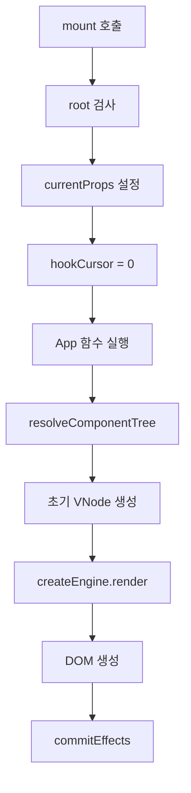
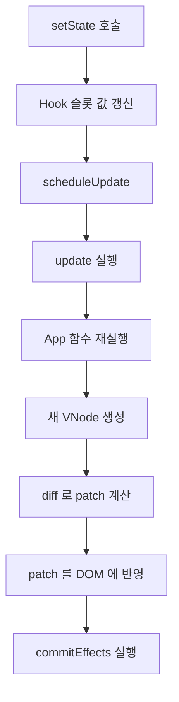

# React-like 런타임 동작 워크스루

## 런타임이 담당하는 책임

런타임은 "화면을 그리는 관리자" 입니다. 맡은 일은 다음과 같습니다.

- 루트 컴포넌트 실행
- Hook 상태 저장
- 상태 변경 시 재렌더 예약
- effect 실행과 cleanup 처리
- unmount 시 정리

## 진입점: createApp()

`createApp()` 은 외부에서 가장 먼저 호출하는 함수입니다.

```js
createApp({
  root: document.getElementById("app"),
  component: App,
  batching: "microtask",
}).mount();
```

내부에서 하는 일은 단순합니다.

1. `root` 가 유효한 DOM 인지 검사
2. `component` 가 함수인지 검사
3. 내부적으로 `FunctionComponent` 인스턴스 생성
4. `mount()`, `unmount()`, `updateProps()` 등을 감싼 앱 객체 반환

즉 `createApp()` 은 사용자 친화적인 래퍼이고, 실제 핵심은 `FunctionComponent` 가 담당합니다.

## 핵심 관리자: FunctionComponent

이 클래스는 루트 컴포넌트를 감싸고 다음 상태를 가집니다.

- `hooks`, `hookCursor`
- `currentProps`, `currentVNode`
- `rootElement`, `isMounted`
- `pendingEffects`, `scheduledUpdate`
- `engine`

### hooks 배열이 필요한 이유

Hook 은 이름이 아니라 호출 순서로 구분합니다. 예를 들어 아래 코드를 보면 됩니다.

```js
const [count, setCount] = useState(0);
const [query, setQuery] = useState("");
const result = useMemo(...);
```

런타임은 이를 대략 이렇게 기억합니다.

- 0 번 슬롯: `useState(0)`
- 1 번 슬롯: `useState("")`
- 2 번 슬롯: `useMemo(...)`

따라서 렌더마다 Hook 호출 순서가 바뀌면 안 됩니다.

## mount 시 흐름

`mount()` 는 첫 렌더를 담당합니다.



`performRender()` 내부에서는 props 저장, `hookCursor` 초기화, dispatcher 등록, `renderFn` 실행, resolver 통과, Hook 개수 검증 순서로 동작합니다.

## update 시 흐름

상태가 바뀌면 `update()` 가 호출됩니다.



전체 DOM 을 다시 만들지 않고 이전 VNode 와 새 VNode 를 비교한 다음 바뀐 부분만 patch 로 반영합니다. 이것이 `Virtual DOM + Diff + Patch` 흐름입니다.

## useState 내부 동작

첫 렌더에서는 슬롯이 없으므로 새 슬롯을 만듭니다.

```js
{
  kind: "state",
  value: initialValue,
  setter: function,
}
```

setter 가 수행하는 단계는 다음과 같습니다.

1. 이미 unmount 된 컴포넌트면 no-op
2. 다음 값을 계산
3. 이전 값과 같으면 종료
4. 다르면 슬롯 값 변경
5. `scheduleUpdate(component)` 호출

setter 는 DOM 을 직접 수정하지 않고 렌더 예약만 수행합니다.

## useEffect 내부 동작

effect 의 핵심 원칙은 다음과 같습니다.

- 렌더 함수 안에서 바로 실행하지 않습니다.
- DOM patch 가 끝난 뒤 실행합니다.
- 이전 cleanup 이 있으면 새 effect 전에 먼저 실행합니다.

실행 단계는 다음 순서를 따릅니다.

1. 렌더 중에는 이번에 실행할 effect 인덱스만 기록
2. DOM 반영 완료
3. `commitEffects()` 호출
4. 이전 cleanup 실행
5. 새 effect 실행
6. 반환값이 함수면 cleanup 으로 저장

## useMemo 내부 동작

`useMemo` 는 값 재사용이 목적입니다. 카드 목록의 정렬·검색 결과 같은 파생 데이터를 매번 다시 계산하면 낭비가 생깁니다. 의존성이 같으면 이전 슬롯의 값을 그대로 반환합니다.

## dispatcher 의 역할

Hook 은 "지금 어떤 루트 컴포넌트의 몇 번째 슬롯을 쓰고 있는가" 를 알아야 합니다. 그 정보를 들고 있는 주체가 dispatcher 입니다. 쉽게 말해 "현재 렌더 중인 주인 컴포넌트" 를 가리키는 포인터입니다.

이 런타임은 다음 규칙을 강제합니다.

- Hook 은 루트 컴포넌트에서만 사용
- 자식 stateless component 에서는 Hook 금지
- Hook 호출 순서가 바뀌면 오류

## 재렌더 예약: scheduleUpdate()

이 함수는 상태 변경 시 재렌더 시점을 결정합니다. 모드는 두 가지입니다.

- `sync`: `setState` 호출 직후 `update()` 를 바로 실행
- `microtask`: 같은 tick 안에서 일어난 여러 상태 변경을 하나의 update 로 합침

microtask 모드는 약한 형태의 batching 에 해당합니다.

## unmount 시 흐름

unmount 는 DOM 만 지우는 작업이 아닙니다. 수행 단계는 다음과 같습니다.

1. 예약된 update 취소
2. effect cleanup 실행
3. DOM 정리
4. dispatcher 와 내부 참조 정리
5. 이후 setter 가 다시 동작하지 않도록 차단

## 요약

한 문장으로 정리하면 이렇게 됩니다.

> `FunctionComponent` 가 Hook 상태를 슬롯 배열로 들고 있고, 상태가 바뀌면 새 VNode 를 계산해 diff/patch 로 DOM 을 최소 수정한 뒤, 마지막에 effect 를 commit 합니다.

## 다음으로 볼 키워드

- VNode 구조와 resolver 역할
- update 흐름과 microtask 스케줄링 세부
- `useState`·`useEffect`·`useMemo` 의 개별 슬롯 동작
